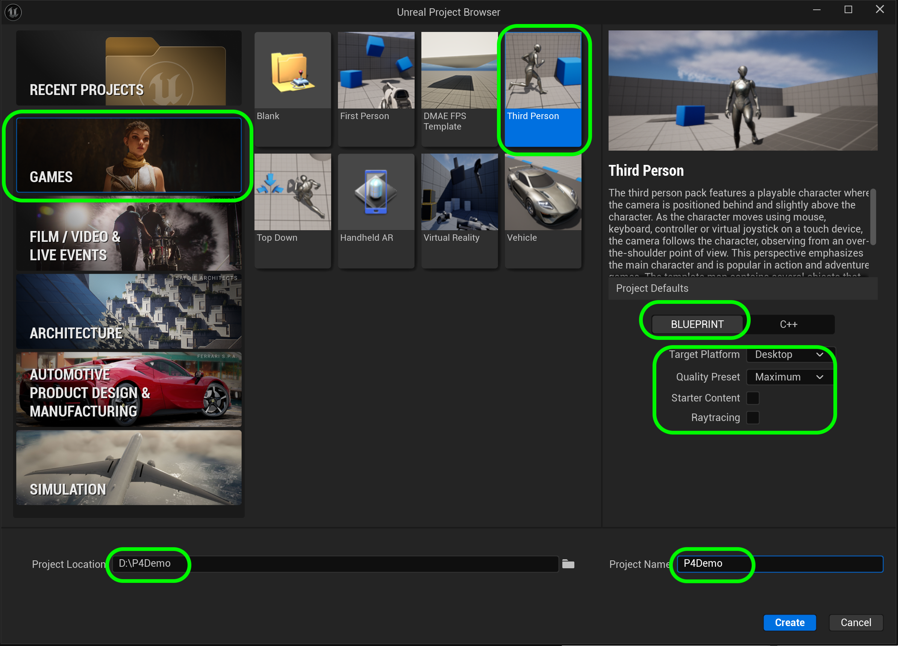
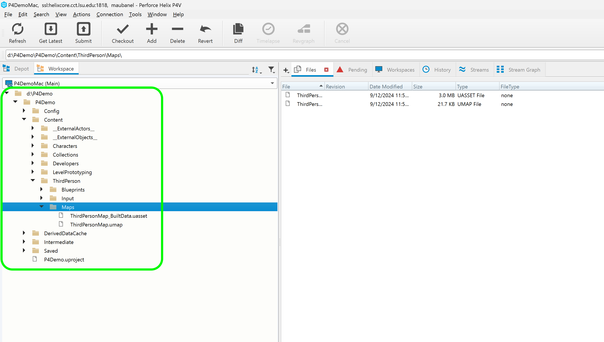
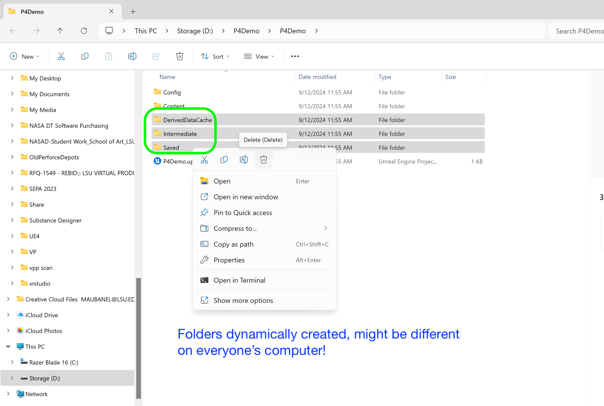
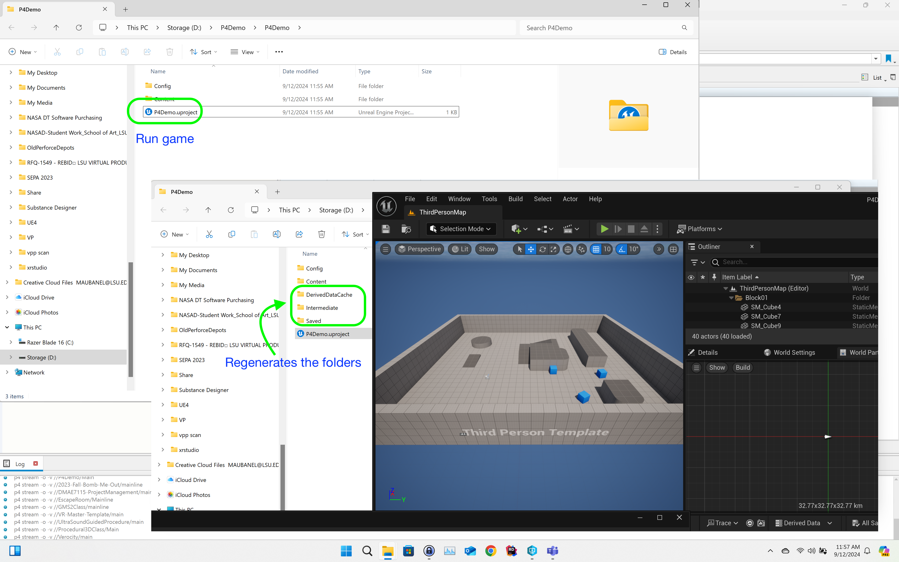
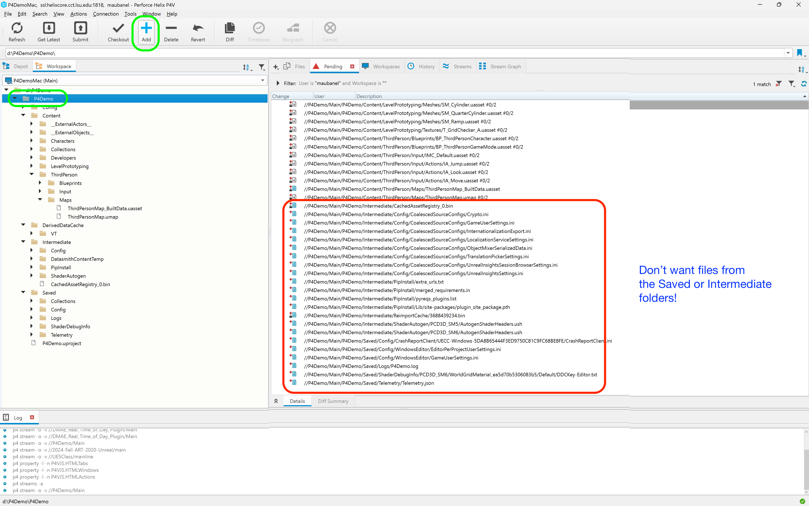
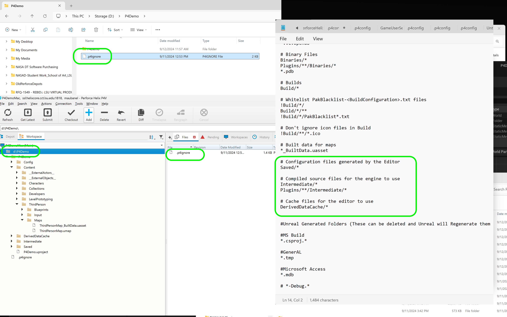
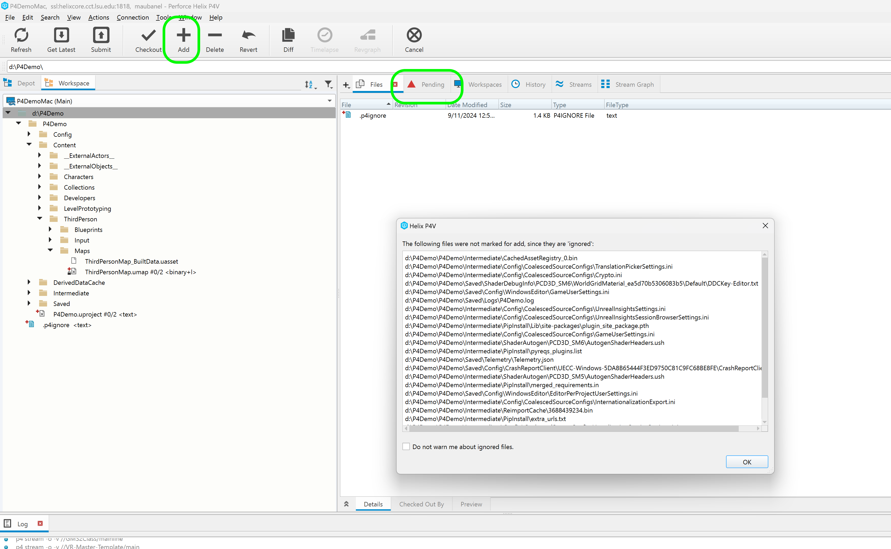
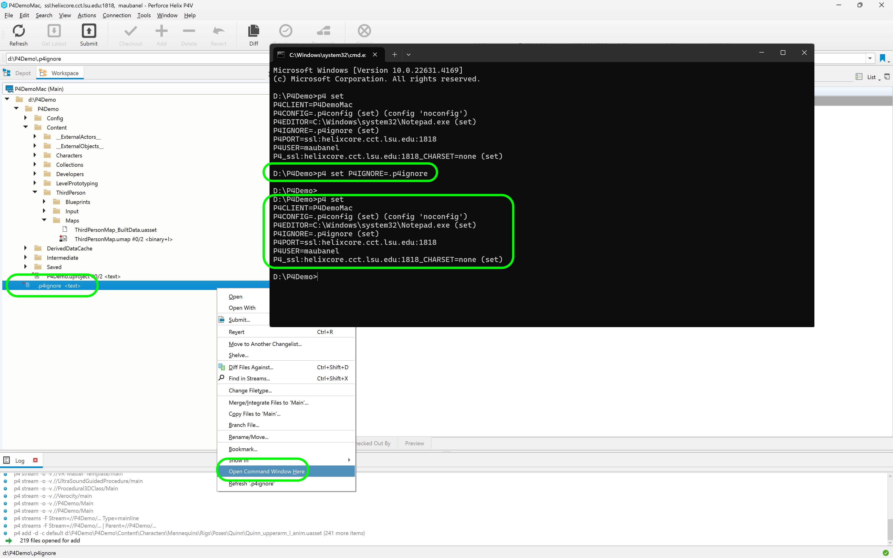
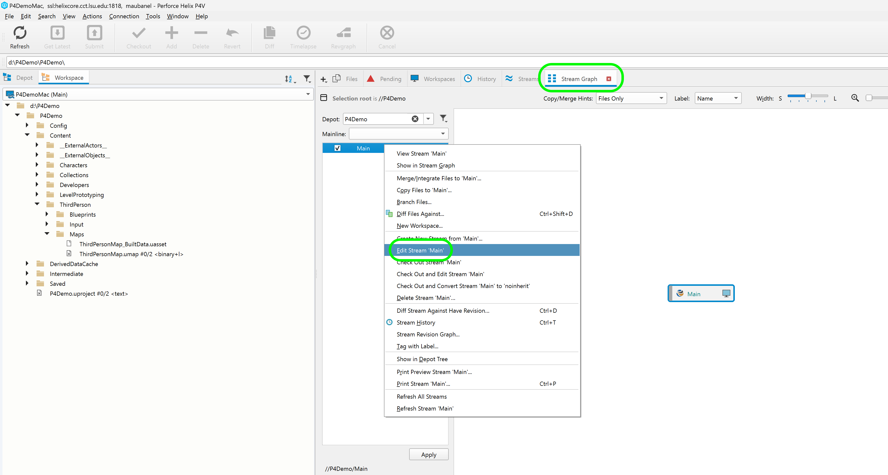
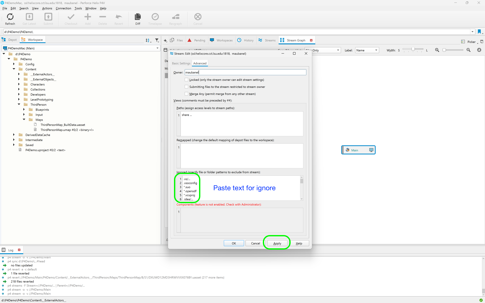

### P4Ignore

[home](../README.md#user-content-ue4-hello-world)

The P4 ignore is really important in Unreal.  There are many files that in Unreal are written to your local hard drive that are generated from the project data.  Now these might differ machine to machine especially with different operating systems. This is especially true with Macs and PCs.

There are two ways of enforcing P4 Ignores.  One in the workspace and one on the server.  The server ignore has more limitations and is not quite as powerful.

[Watch YouTube Video Here](https://www.youtube.com/watch?v=S4A3MmBqtrw)
 

---

##### `Step 1.`\|`P4VUE5`|:small_blue_diamond:

Lets create a new Unreal 5.X.X project. I am putting it in the root of a valid [Perforce Workspace](https://github.com/maubanel/p4v-unreal/blob/main/workspaces/README.md#user-content-workspaces-in-p4v). It is in a directory called `D:\P4Demo` and the project name is **P4Demo**. Press the **Create** button.

##### `Step 2.`\|`P4VUE5`|:small_blue_diamond: :small_blue_diamond: 

Now if you go to **P4V** and refresh the folder you will see all your files and folders adn they are all unstaged (blank sheet of paper icon).

##### `Step 3.`\|`P4VUE5`|:small_blue_diamond: :small_blue_diamond: :small_blue_diamond:

Now the reason we need an ignore file is that there are folders that hold local work relative to my local machine.  The Derived Data Cache are shaders built from my specific video card, the Intermediate has compiled blueprints (again, native to my operating system will be different on mac and pc).

The **Saved** folder is a cache for my local personal settings and work.  None of the these folders want to be shared.  And in fact Unreal doesn't need them to run the game.  

To demonstrate **Delete** the `DerivedDataCache`, `Intermediate`, and `Saved` folders.

##### `Step 4.`\|`P4VUE5`|:small_blue_diamond: :small_blue_diamond: :small_blue_diamond: :small_blue_diamond:

Now run the game again from **Explorer**.  Notice that it rebuilds those three folders.  Please note you will lose any local settings that are cached (like your Perforcve settings) as this is stored in the **Saved** folder.

I am just showing this as an example of why these are local and MUSN'T be shared with the entire team.  The **Config** and **Content** folders are shared amongst all and we want them to appear in the source depot.

##### `Step 5.`\|`P4VUE5`| :small_orange_diamond:

So the issue if we stage the files by adding them (select the top folder and press the **+ Add** button). Notice that it adds all the files including the ones in the folders we don't want to upload.

##### `Step 6.`\|`P4VUE5`| :small_orange_diamond: :small_blue_diamond:

One way of dealing with the issue is with a `.p4ignore` file. You should make sure you place the file in the root of the project. Here is the template that I use [.p4ignore](../files/.p4ignore). Make sure it is called `.p4ignore` and not `.p4ignore.txt` or `p4ignore.txt`.

The `.` in front of the name will hide it by default on macs and PCs.  Google `show hidden files` to find out how to un-hide files on yor computer.

If you look at the file you will notice that it includes the following syntax: `Intermediate/*`.  This means that it will not upload to the server any files or folders within a directory called **Intermediate**. 

##### `Step 7.`\|`P4VUE5`| :small_orange_diamond: :small_blue_diamond: :small_blue_diamond:

I reverted the previous commit.  I go to the top folder and press the **Add** button again to re-add files to the depot. Now I get a message saying that all the files in the protected folders will not be submitted.

This only works if you have the environment variables set up correct.  If you follow the [setting up environment](https://github.com/maubanel/p4v-unreal/blob/main/environment/README.md#user-content-set-up-environment-variables) variables the commands get set up for you.

##### `Step 8.`\|`P4VUE5`| :small_orange_diamond: :small_blue_diamond: :small_blue_diamond: :small_blue_diamond:

If it is not working click on any file at the root of your project (in this case the `.p4ignore`) and select **Open Command Window Here**. The type: `p4 set P4SET=.p4ignore`. Then type `p4 set` and enter.  You should see a valid:
* Client (Workspace)
* Config (optional)
* Ignore
* Port (P4 server)
* Host (computer you are on)
* User

If you do see the ignore set up then try reverting and adding again and it should work.

##### `Step 9.`\|`P4VUE5`| :small_orange_diamond: :small_blue_diamond: :small_blue_diamond: :small_blue_diamond: :small_blue_diamond:

Now you can also ignore files on the server itself.  You cannot use wildcards so you are limited to how fancy you can get.  But we can block entire folders.  Go the the **Stream Graph** and right click on the stream (if you have the right levels of permission) and select **Edit Stream Main** (or whatever your stream is called.  

##### `Step 10.`\|`P4VUE5`| :large_blue_diamond:

Now you can  paste the contents of [StreamIgnore.txt](../files/ue5/StreamIgnore.txt). Paste into the **Advanced ** tab in the ignored section.

Notice that we can't include wildcards like `*` and `**` that we were able to in the p4 ignore.  Also to hide an entire directory you need to use Perforce's syntax of `Saved/...` with the ellipses meaning all files and folders in **Saved**.

Press the **Apply** button. Now we are protected on the clients and on the server to have unwanted files and folders written to our repository.

##### `Step 11.`\|`P4VUE5`| :large_blue_diamond: :small_blue_diamond: 

So now you will see on your **Workspace** locally you have all the files and folders.  The shared ones with the team and the ones for your computer and settings.  On the **Depot** tab the server just has the files you are all workign on together.  If you see the **Saved** or **Intermediate** folders on the server talk to your admin to have them permanently deleted (not removed through perforce as this is not going to remove them from the history and will take up unnecessary space on the server).

| [home](../README.md#user-content-ue4-hello-world) | 
|---|
