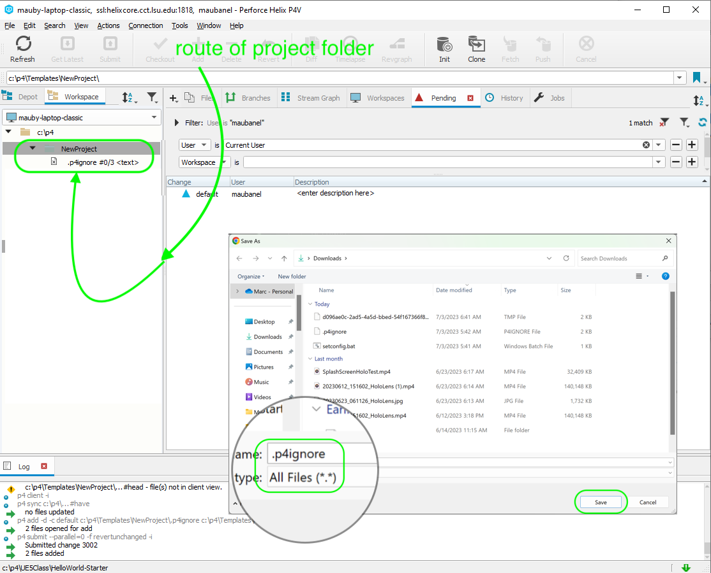

### P4Ignore

[previous](../first-hour/README.md#user-content-first-hour-in-ue4) • [home](../README.md#user-content-ue4-hello-world) • [next](../readme/README.md#user-content-readmemd-file)

The P4 ignore is really important in Unreal.  There are many files that in Unreal are written to your local hard drive that are generated from the project data.  Now these might differ machine to machine especially with different operating systems. This is especially true with Macs and PCs.

 

---

##### `Step 1.`\|`P4VUE5`|:small_blue_diamond:

You need to make sure the is a `.p4ignore` file in the root of the project. If you are going to be adding an existing project to this folder you can download a preconfigured file [.p4ignore](../files/.p4ignore) by right clicking on **Raw** and selecting **Save Link** and call it `.p4ignore` (very important to have the dot before the `p4ignore` as it is a hidden file).  Make sure you change the **Save as type** to `All Files(*.*)`. Place it in the root of your project folder accordingly. Make sure there is no `.txt` extension at the end.

##### `Step 2.`\|`P4VUE5`|:small_blue_diamond: :small_blue_diamond: 

Lets 

##### `Step 3.`\|`P4VUE5`|:small_blue_diamond: :small_blue_diamond: :small_blue_diamond:

##### `Step 4.`\|`P4VUE5`|:small_blue_diamond: :small_blue_diamond: :small_blue_diamond: :small_blue_diamond:

##### `Step 5.`\|`P4VUE5`| :small_orange_diamond:

##### `Step 6.`\|`P4VUE5`| :small_orange_diamond: :small_blue_diamond:

##### `Step 7.`\|`P4VUE5`| :small_orange_diamond: :small_blue_diamond: :small_blue_diamond:

##### `Step 8.`\|`P4VUE5`| :small_orange_diamond: :small_blue_diamond: :small_blue_diamond: :small_blue_diamond:

##### `Step 9.`\|`P4VUE5`| :small_orange_diamond: :small_blue_diamond: :small_blue_diamond: :small_blue_diamond: :small_blue_diamond:

##### `Step 10.`\|`P4VUE5`| :large_blue_diamond:

##### `Step 11.`\|`P4VUE5`| :large_blue_diamond: :small_blue_diamond: 

##### `Step 12.`\|`P4VUE5`| :large_blue_diamond: :small_blue_diamond: :small_blue_diamond: 

##### `Step 13.`\|`P4VUE5`| :large_blue_diamond: :small_blue_diamond: :small_blue_diamond:  :small_blue_diamond: 

##### `Step 14.`\|`P4VUE5`| :large_blue_diamond: :small_blue_diamond: :small_blue_diamond: :small_blue_diamond:  :small_blue_diamond: 

##### `Step 15.`\|`P4VUE5`| :large_blue_diamond: :small_orange_diamond: 

##### `Step 16.`\|`P4VUE5`| :large_blue_diamond: :small_orange_diamond:   :small_blue_diamond: 

##### `Step 17.`\|`P4VUE5`| :large_blue_diamond: :small_orange_diamond: :small_blue_diamond: :small_blue_diamond:

##### `Step 18.`\|`P4VUE5`| :large_blue_diamond: :small_orange_diamond: :small_blue_diamond: :small_blue_diamond: :small_blue_diamond:

##### `Step 19.`\|`P4VUE5`| :large_blue_diamond: :small_orange_diamond: :small_blue_diamond: :small_blue_diamond: :small_blue_diamond: :small_blue_diamond:

##### `Step 20.`\|`P4VUE5`| :large_blue_diamond: :large_blue_diamond:

##### `Step 21.`\|`P4VUE5`| :large_blue_diamond: :large_blue_diamond: :small_blue_diamond:

___

| [previous](../first-hour/README.md#user-content-first-hour-in-ue4)| [home](../README.md#user-content-ue4-hello-world) | [next](../readme/README.md#user-content-readmemd-file)|
|---|---|---|
