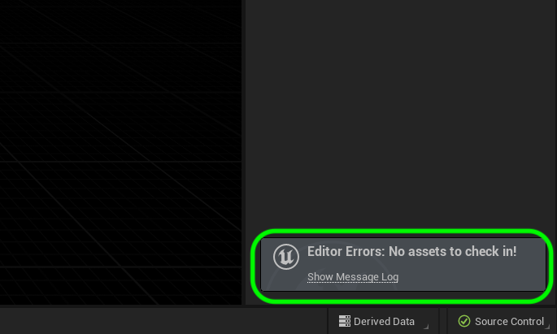
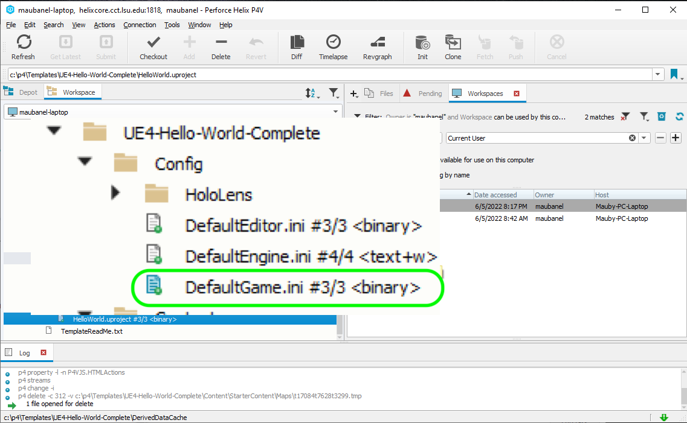

### Editing Config Files

[previous](../) • [home](../README.md#user-content-gms2-background-tiles--sprites---table-of-contents) • [next](../)

Editing configuration files like those saved for **Editor Preferences** and **Project Settings** cannot be submitted through the UE5 editor to **Perforce**.  If the file does not show up in the **Contents** folder it will not be commited to source control when saving all files.  Lets look at a few examples.

 

---

##### `Step 1.`\|`BTS`|🔹

Open up ***UE5** and select **Edit | Project Settings**.  Go to **Project | Maps & Modes** and I am changing what level we are booting up in.

##### `Step 2.`\|`BTS`|🔹🔹

Press **File | Save All** then go to commit the changes.  Notice there is an error. Or if there is not, you see other files as having changed and nothing with an `.ini` as an extension.

##### `Step 3.`\|`BTS`|🔹🔹🔹

Quit **UE5** and look at **P4V**.  Open up the **Content | Config** folder.  You will notice that the [icon](https://github.com/maubanel/p4v-unreal/blob/main/icons/README.md#user-content-p4v-icons) has changed in the **DefaultGame.ini** file.  This is a solid color over the file and it indicates that this `file in your workspace has changed and is ahead of the depot - needs to be added and submitted`.

What ahead of depot means is that this change is in your **Workspace** but has not been **submitted** to the **Depot**.

##### `Step 4.`\|`BTS`|🔹🔹🔹🔹

##### `Step 5.`\|`BTS`| 🔸

##### `Step 6.`\|`BTS`| 🔸🔹

##### `Step 7.`\|`BTS`| 🔸🔹🔹

##### `Step 8.`\|`BTS`| 🔸🔹🔹🔹

##### `Step 9.`\|`BTS`| 🔸🔹🔹🔹🔹

##### `Step 10.`\|`BTS`| 🔷

##### `Step 11.`\|`BTS`| 🔷🔹

##### `Step 12.`\|`BTS`| 🔷🔹🔹

##### `Step 13.`\|`BTS`| 🔷🔹🔹🔹

##### `Step 14.`\|`BTS`| 🔷🔹🔹🔹🔹

##### `Step 15.`\|`BTS`| 🔷🔸 

##### `Step 16.`\|`BTS`| 🔷🔸🔹

##### `Step 17.`\|`BTS`| 🔷 🔸🔹🔹

##### `Step 18.`\|`BTS`| 🔷 🔸🔹🔹🔹

##### `Step 19.`\|`BTS`| 🔷 🔸🔹🔹🔹🔹

##### `Step 20.`\|`BTS`| 🔷🔷

##### `Step 21.`\|`BTS`| 🔷🔷🔹

___

CREATE BANNER WITH https://via.placeholder.com/1000x100/45D7CA/000000/?text=Next Up - ADD NEXT PAGE

| [previous](../)| [home](../README.md#user-content-gms2-background-tiles--sprites---table-of-contents) | [next](../)|
|---|---|---|
