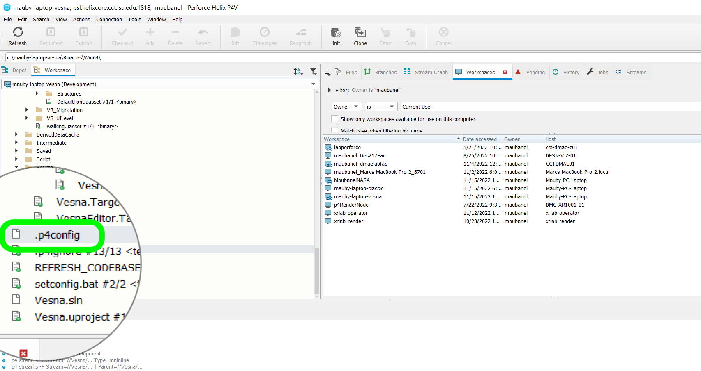
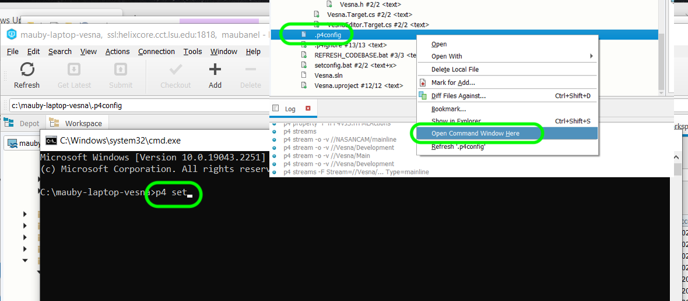
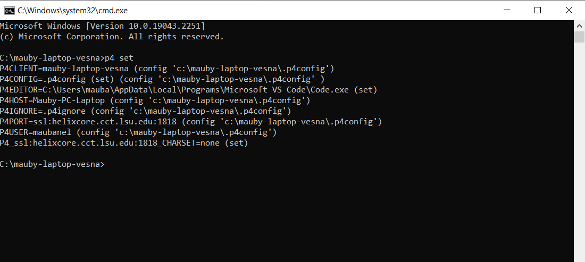

### Perforce Environment Variables

[home](../README.md#user-content-p4v)

https://github.com/user-attachments/assets/35199b48-922e-4b98-ac17-72dbe49dcca1

[YouTube Link](https://www.youtube.com/watch?v=ZZ0foIfY1Ac)

=======
[YouTube Link](https://youtu.be/ljbY4CH_JZE)

* It is a good idea to use a config file so that it automatically configs your environment correctly in each project.
* If you are unable to loginto Perforce inside of Unreal this might help with that making it work more consistently.
* For PC's only,  copy this file into your project directory of your **Workspace** [setconfig.bat](../files/ue5/setconfig.bat)
* Edit the batch file and enter the location of your perforce repository then save it to the root folder of your project.
* You can copy it by right clicking on the above and then right clicking on **Raw** and selecting `Save link as...`
* Place the `setconfig.bat` file in your root directory of your perforce workspace (this file should be in the topmost folder)
* Double click the `setconfig.bat` file and answer all the questions.  This will set up a `.p4config file` that will ensure that environment variables are set properly.
* * DO NOT run this batch file from P4V.  It will save the file to the wrong folder. Double click the `.bat` file from `explorer`.
* Both the host and the workspace name can be copy and pasted by double clicking your workspace in `P4V`.
* This file has to be created for each Workspace and can't be shared amongst projects and are ignored in the `.p4ignore` file.
* This will add a `.p4config` file root of your project folder (same folder as you `.uproject`) if you have done this correctly.

* Right click on the `.p4config` and select **Open Command Window Here**. This will bring up the command prompt in your project directory.  Type `p4 set` and press the <kbd>Return</kbd> key.

* Now you should see that all the environment variables are set by this file.

## Hostnames on Mac OSX
* Mac's will change hostnames when it is on networks like LSU's with dynamic IP's (and maybe some folks home system).
* Open **System Preference**s, click **General | Sharing** and take note of of the value in the **Local hostname** field (typically as a .local) at the end.
* Click **Edit** and make sure the "Use dynamic global hostname" checkbox is **unchecked**.
* Open up **Terminal** and check the name before the cursor and see if it i the same at the hostname above?
* If not then enter `sudo scutil --set HostName new_hostname`.  So in my case it was `sudo scutil --set HostName MarcA.local`.

| [home](../README.md#user-content-p4v) |
|---|
