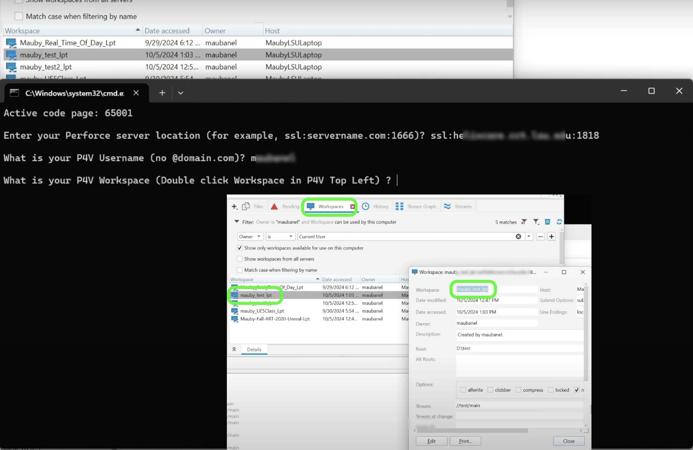
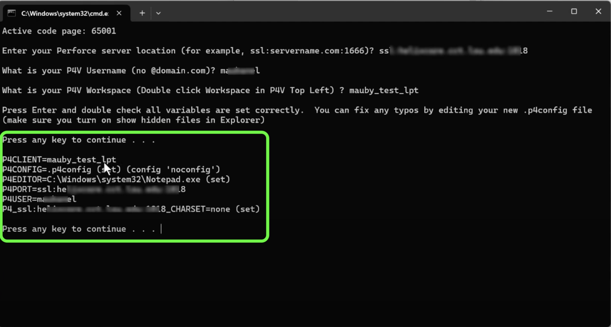
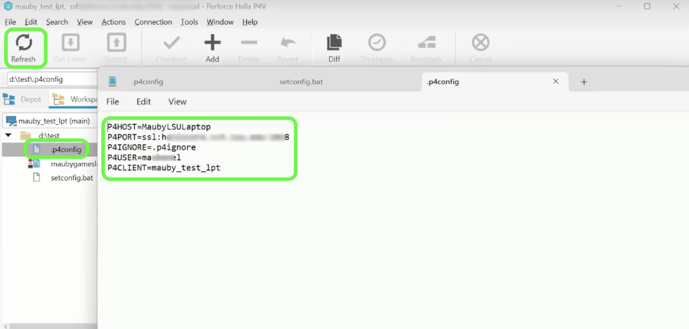
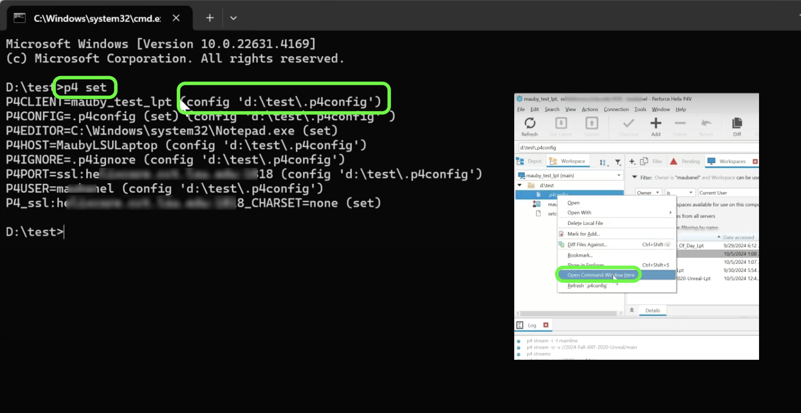
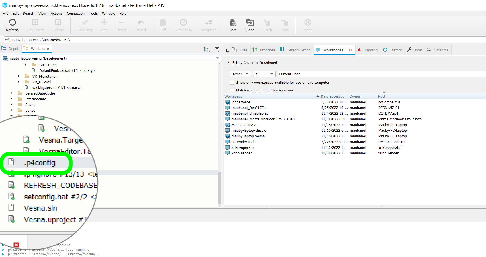

### Perforce Environment Variables

[home](../README.md#user-content-p4v)

https://github.com/user-attachments/assets/35199b48-922e-4b98-ac17-72dbe49dcca1

Perforce has some key environment variables that have to be set up correctly for it to work.  When working on multiple projects this can be tricky.  Below we will be looking at my preferred way of setting up these variables using a batch file.

Watch the [YouTube Video](https://youtu.be/ljbY4CH_JZE) for a more complete explanation.

##### `Step 1.`\|`P4VUE5`|:small_blue_diamond:

It is a good idea to use a config file so that it automatically configs your environment correctly in each project. For PC's only, download the [set_p4_pc.bat] for PCs or (../files/ue5/set_p4_pc.bat) or [set_p4_mac.sh](../files/ue5/set_p4_mac.sh) file for macs.

##### `Step 2.`\|`P4VUE5`|:small_blue_diamond: :small_blue_diamond:

Right click on the **SetConfig.bat** file and select **Unblock**.  You only need to do this if you want to avoid getting a warning that it is not from a trusted developer everytime you run it.  The batch file just writes text the the directory it runs from.

##### `Step 3.`\|`P4VUE5`|:small_blue_diamond: :small_blue_diamond: :small_blue_diamond:

Place this file into the root (top folder) of your project directory of your **Workspace**

##### `Step 4.`\|`P4VUE5`|:small_blue_diamond: :small_blue_diamond: :small_blue_diamond: :small_blue_diamond:

Run the batch file by double clicking it. The first thing it will ask is for you to enter the location of the repository.  Remember if it is a secure ssl connection you need to preface the name with `ssl:` and after the repository location you need to give the port used to set it up `ssl:location.com:1666`.

##### `Step 5.`\|`P4VUE5`| :small_orange_diamond:

Enter your user name (not your email address no `@gmail.com`). 

##### `Step 6.`\|`P4VUE5`| :small_orange_diamond: :small_blue_diamond:

The final thing to do is to enter the name of the **Workspace**.  If you don't remember it go to the **Workspace** tab and double click the one you are using.  In the top right corner you can copy and paste the workspace name. 

##### `Step 7.`\|`P4VUE5`| :small_orange_diamond: :small_blue_diamond: :small_blue_diamond:

Press enter and make sure all the data is entered correctly. Behind the scenes we ran two commands that are required to use the `.p4ignore` and the `.p4config`.  The script ran `p4 set P4IGNORE=.p4ignore` and `p4 set P4CONFIG=.p4config`.  Please remember that you need to activate show hidden files (google it) on your computer to see these files. Adding these two files is not enough you need to run the command to set them.  This is done once on your computer then it will not have to be repeated.

##### `Step 8.`\|`P4VUE5`| :small_orange_diamond: :small_blue_diamond: :small_blue_diamond: :small_blue_diamond:

Now in **P4V** press the **Refresh** button and you should see a `.p4config` file.  Double click it and you should see a file similar to the one below.

##### `Step 9.`\|`P4VUE5`| :small_orange_diamond: :small_blue_diamond: :small_blue_diamond: :small_blue_diamond: :small_blue_diamond:

Lets test to make sure the `.p4config` file works properly.  Right click in **P4V** on any of the root folder files and select **Open Command Window Here**. Now in the command window type `p4 set` and press the **Enter/Return** key. You should see that it is loading from the config file.

##### `Step 10.`\|`P4VUE5`| :large_blue_diamond:

You need a separate workspace for each computer, which necessitates a separate `.p4config` file for each space.  Run the batch file on all the computers you are using and don't forget to do this when you are setting up!

## Hostnames on Mac OSX
* Mac's will sometimes change hostnames when it is on another networks like with dynamic IP's (and maybe some folks home system).
* Open **System Preferences**, click **General | Sharing** and take note of of the value in the **Local hostname** field (typically as a .local) at the end.
* Click **Edit** and make sure the "Use dynamic global hostname" checkbox is **unchecked**.
* Open up **Terminal** and check the name before the cursor and see if it i the same at the hostname above?
* If not then enter `sudo scutil --set HostName new_hostname`.  So in my case it was `sudo scutil --set HostName MarcA.local`.

| [home](../README.md#user-content-p4v) |
|---|
