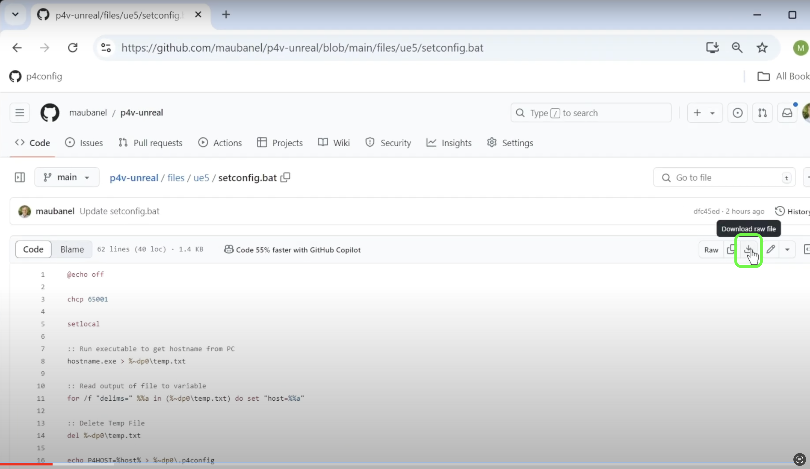
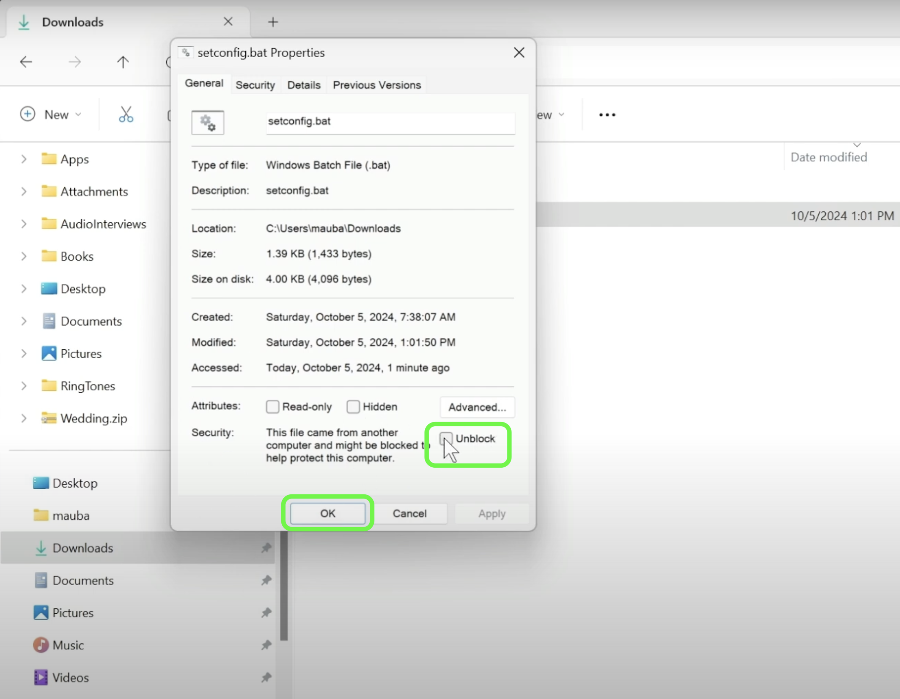
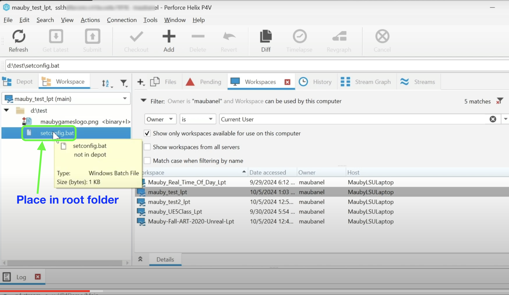
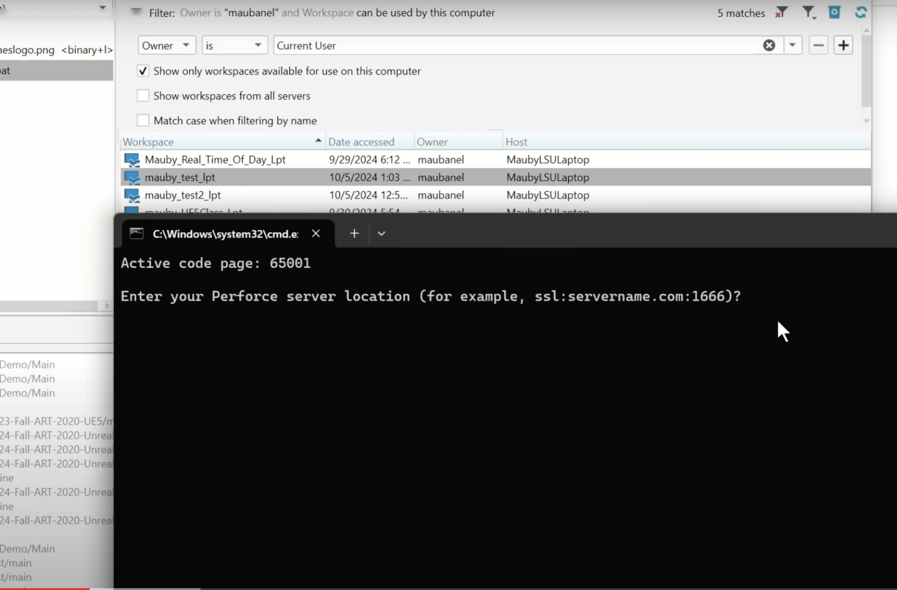
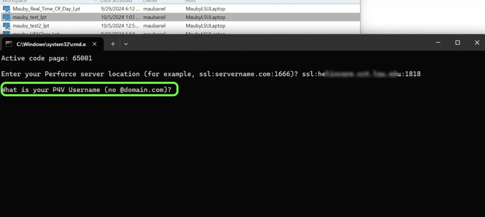
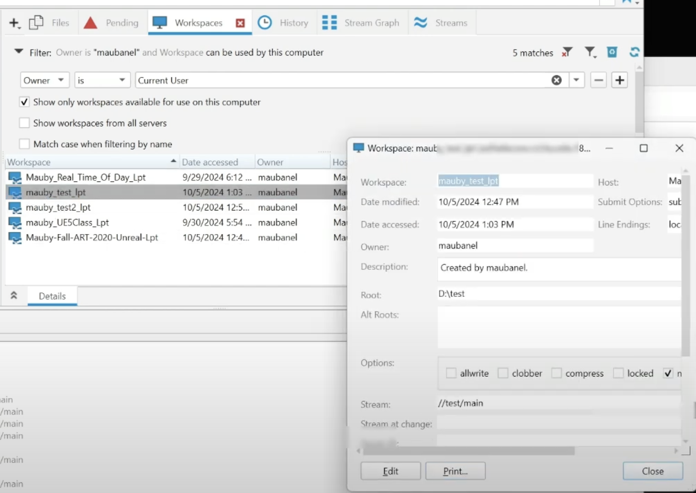

### Perforce Environment Variables

[home](../README.md#user-content-p4v)

https://github.com/user-attachments/assets/35199b48-922e-4b98-ac17-72dbe49dcca1

Perforce has some key environment variables that have to be set up correctly for it to work.  When working on multiple projects this can be tricky.  Below we will be looking at my preferred way of setting up these variables using a batch file.

Watch the [YouTube Video](https://youtu.be/ljbY4CH_JZE) for a more complete explanation.

##### `Step 1.`\|`P4VUE5`|:small_blue_diamond:

It is a good idea to use a config file so that it automatically configs your environment correctly in each project. For PC's only, download the [setconfig.bat](../files/ue5/setconfig.bat) file.

##### `Step 2.`\|`P4VUE5`|:small_blue_diamond: :small_blue_diamond:

Right click on the **SetConfig.bat** file and select **Unblock**.  You only need to do this if you want to avoid getting a warning that it is not from a trusted developer everytime you run it.  The batch file just writes text the the directory it runs from.

##### `Step 3.`\|`P4VUE5`|:small_blue_diamond: :small_blue_diamond: :small_blue_diamond:

Place this file into the root (top folder) of your project directory of your **Workspace**

##### `Step 4.`\|`P4VUE5`|:small_blue_diamond: :small_blue_diamond: :small_blue_diamond: :small_blue_diamond:

Run the batch file by double clicking it. The first thing it will ask is for you to enter the location of the repository.  Remember if it is a secure ssl connection you need to preface the name with `ssl:` and after the repository location you need to give the port used to set it up `ssl:location.com:1666`.

##### `Step 5.`\|`P4VUE5`| :small_orange_diamond:

Enter your user name (not your email address no `@gmail.com`). 

##### `Step 6.`\|`P4VUE5`| :small_orange_diamond: :small_blue_diamond:

The final thing to do is to enter the name of the **Workspace**.  If you don't remember it go to the **Workspace** tab and double click the one you are using.  In the top right corner you can copy and paste the workspace name. 

* You can copy it by right clicking on the above and then right clicking on **Raw** and selecting `Save link as...`
* Place the `setconfig.bat` file in your root directory of your perforce workspace (this file should be in the topmost folder)
* Double click the `setconfig.bat` file and answer all the questions.  This will set up a `.p4config file` that will ensure that environment variables are set properly.
* * DO NOT run this batch file from P4V.  It will save the file to the wrong folder. Double click the `.bat` file from `explorer`.
* Both the host and the workspace name can be copy and pasted by double clicking your workspace in `P4V`.
* This file has to be created for each Workspace and can't be shared amongst projects and are ignored in the `.p4ignore` file.
* This will add a `.p4config` file root of your project folder (same folder as you `.uproject`) if you have done this correctly.

* Right click on the `.p4config` and select **Open Command Window Here**. This will bring up the command prompt in your project directory.  Type `p4 set` and press the <kbd>Return</kbd> key.

* Now you should see that all the environment variables are set by this file.

## Hostnames on Mac OSX
* Mac's will change hostnames when it is on networks like LSU's with dynamic IP's (and maybe some folks home system).
* Open **System Preference**s, click **General | Sharing** and take note of of the value in the **Local hostname** field (typically as a .local) at the end.
* Click **Edit** and make sure the "Use dynamic global hostname" checkbox is **unchecked**.
* Open up **Terminal** and check the name before the cursor and see if it i the same at the hostname above?
* If not then enter `sudo scutil --set HostName new_hostname`.  So in my case it was `sudo scutil --set HostName MarcA.local`.

| [home](../README.md#user-content-p4v) |
|---|
