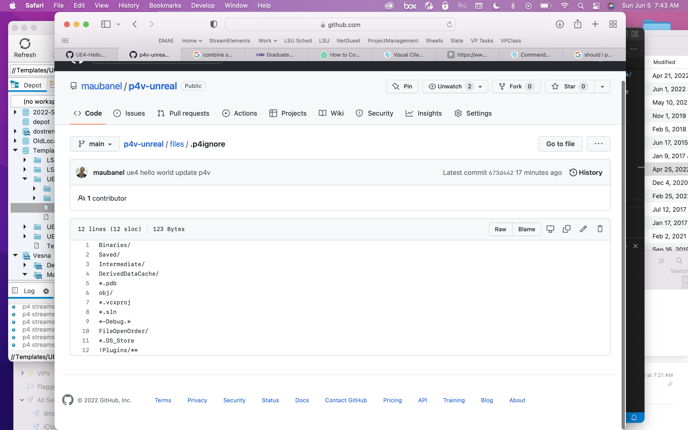

### P4 Ignore

[home](../README.md#user-content-p4v)

The `.p4ignore` file plays a very important role.  It makes sure the repository isn't tracking files that are genearted locally (or lacl user settings) to the repository.

 

---

##### `Step 1.`\|`BTS`|:small_blue_diamond:

Our basic UE5 [.p4ignore](../files/ue5/.p4ignore) is to make sure that files that don't need to be generated are not stored in the repository. 

| [home](../README.md#user-content-p4v)  |
|---|
