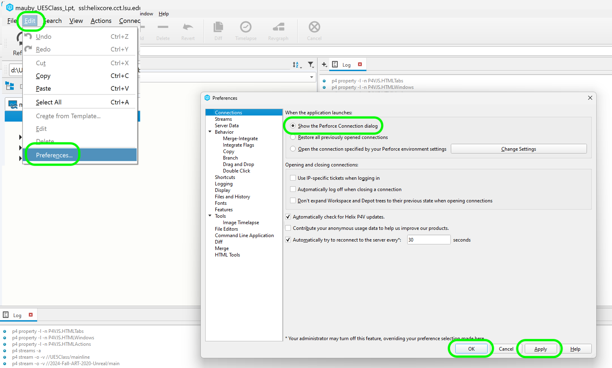

### Installing P4V

[home](../README.md#user-content-p4v)

There are three main applications to install.  **P4V** which is tthe GUI controller for source control.  **P4** which is the command line version control.  **P4Admin** for administration if you have admininstration access.  If you are not an administrator then you do not need to install **P4Admin**.

https://github.com/user-attachments/assets/55ae76ce-3c46-4720-b48a-66e507a9db0f

[YouTube Link](https://youtu.be/WM-TjoJc4no)
 

---

##### `Step 1.`\|`BTS`|:small_blue_diamond:

Download [P4V](https://www.perforce.com/downloads/helix-visual-client-p4v) which is the GUI manager that should work for most issues that arise.  This will install all the software you need. If you are installing on a mac you need to select either the Intel or Apple Silicone and which version of the OS you are running.  On a PC select the `.exe` if you are not familiar with installing `.msi` programs (they both do the same thing). 

##### `Step 2.`\|`BTS`|:small_blue_diamond: :small_blue_diamond: 

Double click the `p4vinst64.msi` file. Install at least the **Helix Visual Client (P4V)** and **Command Line Client (P4)**.  The **Merge and Diff Tool** and **Administration Tool** are optional.

Then enter the address for your **P4 Server** address and **Username**. You can select your text editor of choice or leave the default.  Press the <kbd>Next</kbd> button. Then press the <kbd>Install</kbd> button.  You can then close the screen out.

##### `Step 3.`\|`BTS`|:small_blue_diamond: :small_blue_diamond: :small_blue_diamond:

Run **P4V** and use the same **Server** and port by entering `ssl:helixcore.cct.lsu.edu:1818`, and use your lsu **User** id *without* the @lsu.edu. We will leave the **Workspace** blank and login to the perforce server. 

Press the <kbd>OK</kbd> button. It will ask you to validate the fingerprint.  That fingerprint will look something like `XX:57:CD:06:14:E9:3A:32:84:A1:41:A3:BF:CC:17:A2:85:D7:AA:591` (We each get a unique fingerprint).  Accept this request. Use your mylsu password that you use to login to all of LSU's services. 

##### `Step 4.`\|`BTS`|:small_blue_diamond: :small_blue_diamond: :small_blue_diamond: :small_blue_diamond:

When it loads up go to the **Depot** tab.  This is all the projects that you have access to that are on the server (cloud).  If you need access to a depot (project folder) then ask an administrator.

##### `Step 5.`\|`P4VUE5`| :small_orange_diamond:

The one change to their default settings that i like to make is to avoid issues trying to load your prior repository.  The default behavior is to _Restore all previous opened connections_ which sounds convenient.  The issue arises when this server is not available or you are trying to load a different server.  It takes a long time to determine if it is available and you do not get the connection dialogue.

I prefer to always have the connection dialogue come up as it is immediate and I don't have to wait a minute or two for P4V to decide that it can't find the server.  So I change the **Edit | Preferences | Connections** category to *Show the Perforce Connection Dialogue*.

| [home](../README.md#user-content-p4v)  |
|---|
