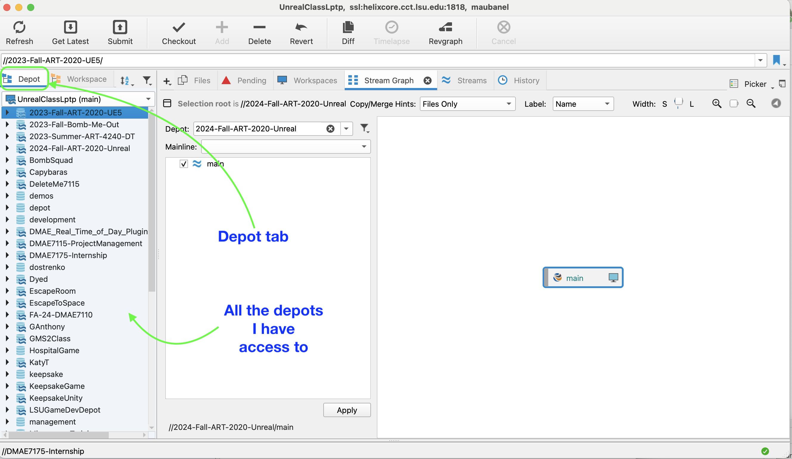

### Installing P4V

[home](../README.md#user-content-gms2-background-tiles--sprites---table-of-contents)

There are three main applications to install.  **P4V** which is tthe GUI controller for source control.  **P4** which is the command line version control.  **P4Admin** for administration if you have admininstration access.  You are not an administrator you do not need to install **P4Admin**.

 

---

##### `Step 1.`\|`BTS`|:small_blue_diamond:

You need to logi nto [Global Protect](https://grok.lsu.edu/article.aspx?articleid=14785) when off campus before you install Perfo.  Otherwise the installer will not find the server. Make sure the vpn is active before moving forward if you are off campus.

##### `Step 2.`\|`BTS`|:small_blue_diamond: :small_blue_diamond: 

If you have access to LSU BOx you can also download the installer on [BOX | DMAE-software | Perforce | p4vinst64.msi](https://lsu.box.com/s/wmjeky4pj2jtg7t8uyfmr4g4xfce9d9r). Otherwise, download [P4V](https://www.perforce.com/downloads/helix-visual-client-p4v) which is the GUI manager that should work for most issues that arise.  

##### `Step 3.`\|`BTS`|:small_blue_diamond: :small_blue_diamond: :small_blue_diamond:

Double click the `p4vinst64.msi` file. Install at least the **Helix Visual Client (P4V)** and **Command Line Client (P4)**.  The **Merge and Diff Tool** and **Administration Tool** are optional.

Then for **Server** enter `helix.core.cct.lsu.edu:1818`, **Username** use your lsu id *without* the @lsu.edu. You can select your text editor of choice or leave the default.  Press the <kbd>Next</kbd> button. Then press the <kbd>Install</kbd> button.  You can then close the screen out.

##### `Step 4.`\|`BTS`|:small_blue_diamond: :small_blue_diamond: :small_blue_diamond: :small_blue_diamond:

Run **P4V** and use the same **Server** and port by entering `helix.core.cct.lsu.edu:1818`, and use your lsu **User** id *without* the @lsu.edu. Use the supplied password. We will leave the **Workspace** blank and login to the perforce server. Press the <kbd>OK</kbd> button.

##### `Step 5.`\|`BTS`| :small_orange_diamond:

When it loads up go to the **Depot** tab.  This is all the projects that you have access to that are on the server (cloud).  
Everyone has access to Depot which is the main depot (but no projects in it).  Everyone has **read** accesss only to **Templates** and **Old Projects**.  Templates are various templates that have the plugins and our XR Lab Configuration set up.  The **Old Projects** are previous projects done by students in prior terms.  You can use these as reference but will not be able to chnage or save to these projects in the repository.  You will also have access to the projects that you are assigned to work on.

##### `Step 6.`\|`BTS`| :small_orange_diamond: :small_blue_diamond:

If the password was assigned you will need to change it for a more secure password.  In **P4V** select **Connection | Change Password** and enter the assigned password and come up with a new one.  It needs to be at least 8 characters with an upper and lower case letter plus one or more symbols or numbers. Now you are ready to create a Workspace.

[home](../README.md#user-content-gms2-background-tiles--sprites---table-of-contents)
|---||
