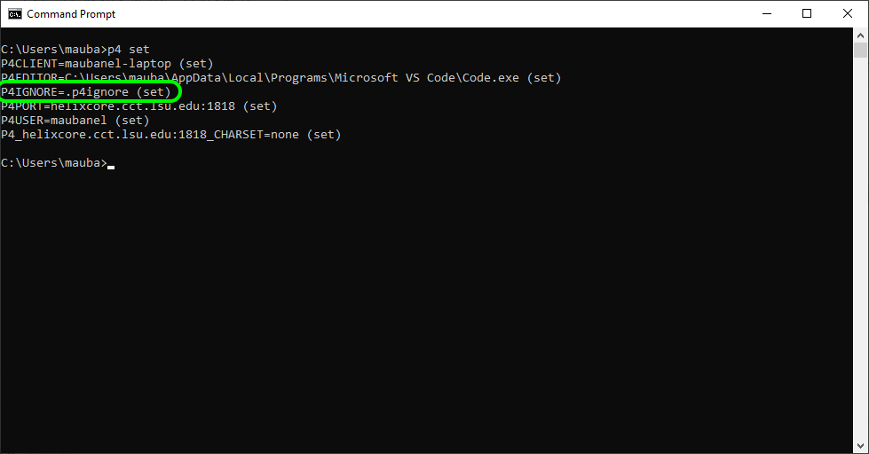
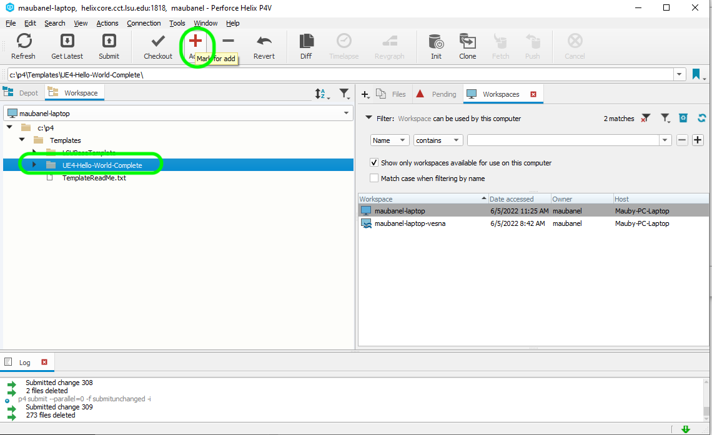
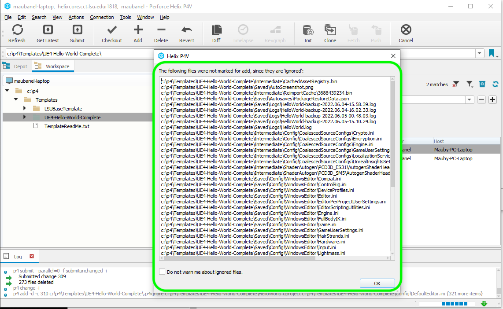
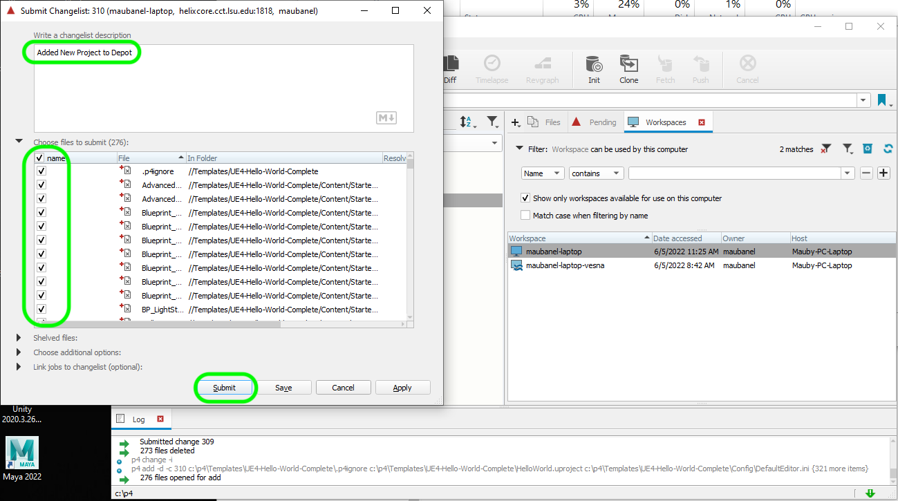
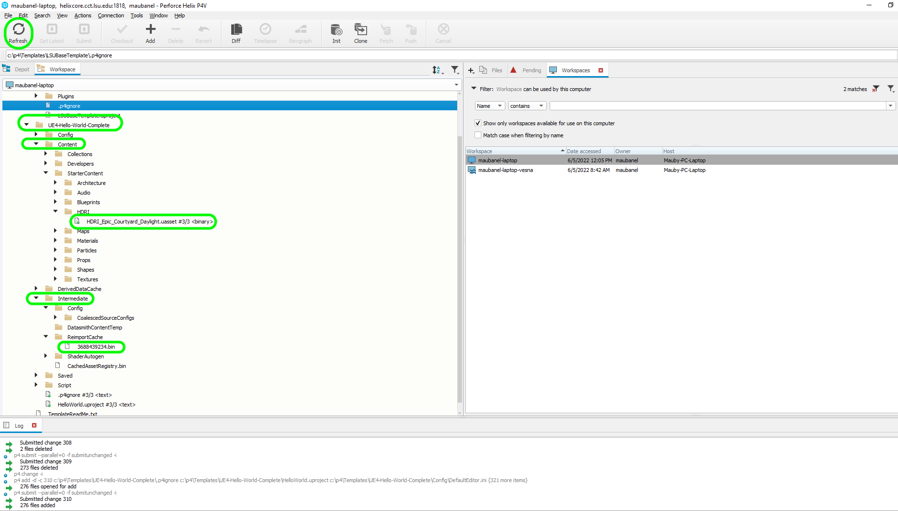

### Large Changes Outside of UE5

[home](../README.md#user-content-p4v)

If you have copied a new project or updated a lot of files outside of the Unreal engine.  It is best to update the **Perforce** depot outside of the engine directly in **P4V**. Inside the engine I have not found a quick way to mark a large amount of files to add in the editor.  Instead we use **P4V**.

 

---

##### `Step 1.`\|`BTS`|:small_blue_diamond:

Make sure you have a [.p4ignore](../files/.p4ignore) file installed in the same directory as the `.uproject` project file. If not add one, a sample can be found here: [.p4ignore](../files/.p4ignore)

##### `Step 2.`\|`BTS`|:small_blue_diamond: :small_blue_diamond: 

Make sure that the `.p4ignore` is active in your workspace by starting the command line and type `p4 type`.  You should see that the workspace is using the `.p4ignore`.

If not run the command `p4 set P4IGNORE=.p4ignore` then run `p4 set` again to make sure this change is typed correctly.

##### `Step 3.`\|`BTS`|:small_blue_diamond: :small_blue_diamond: :small_blue_diamond:

Now open up **P4V** and highlight the folder with a large amount of filechanges (or a brand new folder entirely). Press the **Add** button.

##### `Step 4.`\|`BTS`|:small_blue_diamond: :small_blue_diamond: :small_blue_diamond: :small_blue_diamond:

Now if the `.p4ignore` file works correctly and there are files that match it will list all the files it will not submit.  In this case a large amount of files in the **Saved** and **Intermediate** folder.  We don't need these as when we run our project it will generate them if they are not already there. If you are happy then press the <kbd>OK</kbd> button.

##### `Step 5.`\|`BTS`| :small_orange_diamond:

Now we get a list of all the files it will add.  Make sure again, there are no files that should have been removed from the `.p4ignore`.  Check the ones you want to include then add a detailed message.  Press the <kbd>submit</bbd> button.

##### `Step 6.`\|`BTS`| :small_orange_diamond: :small_blue_diamond:

Now all the files that are in the **Content** folder are added. You will see a very small green checkmark which means it has the latest version from the dept.  To find out the meaning of the **P4V** icons go to this [github page on p4v icons](https://github.com/maubanel/p4v-unreal/blob/main/icons/README.md#user-content-p4v-icons). For files that are ignored they have no icons meaning they are not tracked by **Perforce** which is what we want.

CREATE BANNER WITH https://via.placeholder.com/1000x100/45D7CA/000000/?text=Next Up - ADD NEXT PAGE

| [home](../README.md#user-content-p4v) | 
|---|
