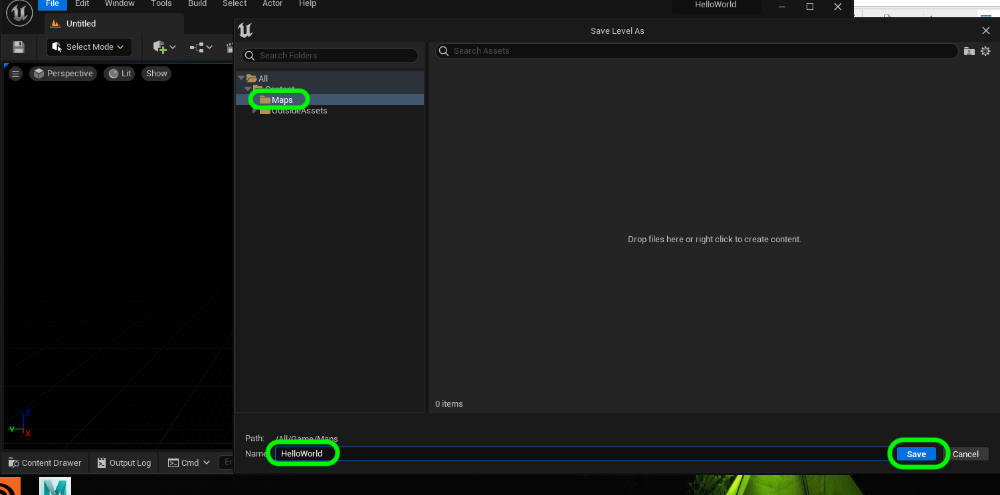

### Adding new Assets to Perforce

[previous](../) • [home](../README.md#user-content-gms2-background-tiles--sprites---table-of-contents) • [next](../)

We are going to add new assets to Perforce that we create in the editor.  We will add a new level to UE5. This new level does not exist in the **Depot** and will only be in your **Workspace**.

 

---

##### `Step 1.`\|`BTS`|:small_blue_diamond:

Open up your **Workspace** in **P4V** and open up your project by double left mouse clicking on the `.uproject` to open Unreal.

##### `Step 2.`\|`BTS`|:small_blue_diamond: :small_blue_diamond: 

 Now make sure that **Source Control** is green.  If not reconnect to source control by signing back in with **Unreal**.

 Press **File | New Level** to load up a new level.

##### `Step 3.`\|`BTS`|:small_blue_diamond: :small_blue_diamond: :small_blue_diamond:

Now select a new **Empty Level** then press the <kbd>Create</kbd> button.

##### `Step 4.`\|`BTS`|:small_blue_diamond: :small_blue_diamond: :small_blue_diamond: :small_blue_diamond:

Open up the **Content Drawer** (you can use the <kbd>Cntrl Space</kbd> as a keyboard shortcut) and right click on **Content** and select `New Folder`.

##### `Step 5.`\|`BTS`| :small_orange_diamond:

Call the new folder `Maps`.

##### `Step 6.`\|`BTS`| :small_orange_diamond: :small_blue_diamond:

Now lets save this new level we created.  Press **File | Save Current Level**.

##### `Step 7.`\|`BTS`| :small_orange_diamond: :small_blue_diamond: :small_blue_diamond:

Select the **Maps** folder and name the level.  I named mine `HelloWorld`.  Press the <kbd>Save</kbd> button.

##### `Step 8.`\|`BTS`| :small_orange_diamond: :small_blue_diamond: :small_blue_diamond: :small_blue_diamond:

Now right click on your project file and select **Source Control | Check In**.  This will add this file to the **Depot** so other members can **Sync** and see the newly completed level.

##### `Step 9.`\|`BTS`| :small_orange_diamond: :small_blue_diamond: :small_blue_diamond: :small_blue_diamond: :small_blue_diamond:

##### `Step 10.`\|`BTS`| :large_blue_diamond:

##### `Step 11.`\|`BTS`| :large_blue_diamond: :small_blue_diamond: 

##### `Step 12.`\|`BTS`| :large_blue_diamond: :small_blue_diamond: :small_blue_diamond: 

##### `Step 13.`\|`BTS`| :large_blue_diamond: :small_blue_diamond: :small_blue_diamond:  :small_blue_diamond: 

##### `Step 14.`\|`BTS`| :large_blue_diamond: :small_blue_diamond: :small_blue_diamond: :small_blue_diamond:  :small_blue_diamond: 

##### `Step 15.`\|`BTS`| :large_blue_diamond: :small_orange_diamond: 

##### `Step 16.`\|`BTS`| :large_blue_diamond: :small_orange_diamond:   :small_blue_diamond: 

##### `Step 17.`\|`BTS`| :large_blue_diamond: :small_orange_diamond: :small_blue_diamond: :small_blue_diamond:

##### `Step 18.`\|`BTS`| :large_blue_diamond: :small_orange_diamond: :small_blue_diamond: :small_blue_diamond: :small_blue_diamond:

##### `Step 19.`\|`BTS`| :large_blue_diamond: :small_orange_diamond: :small_blue_diamond: :small_blue_diamond: :small_blue_diamond: :small_blue_diamond:

##### `Step 20.`\|`BTS`| :large_blue_diamond: :large_blue_diamond:

##### `Step 21.`\|`BTS`| :large_blue_diamond: :large_blue_diamond: :small_blue_diamond:

___

CREATE BANNER WITH https://via.placeholder.com/1000x100/45D7CA/000000/?text=Next Up - ADD NEXT PAGE

| [previous](../)| [home](../README.md#user-content-gms2-background-tiles--sprites---table-of-contents) | [next](../)|
|---|---|---|
