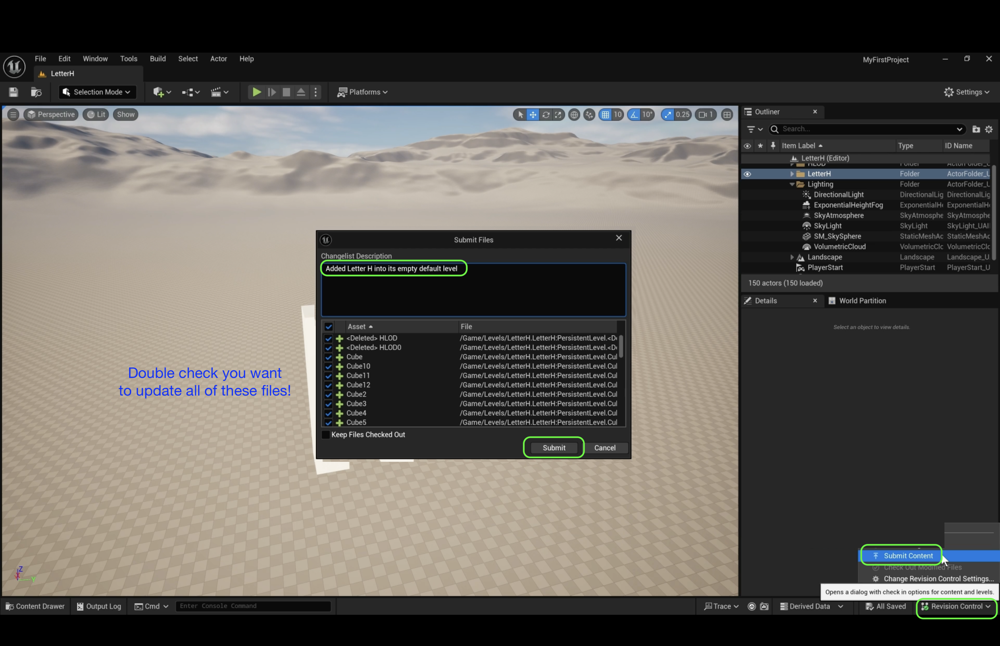
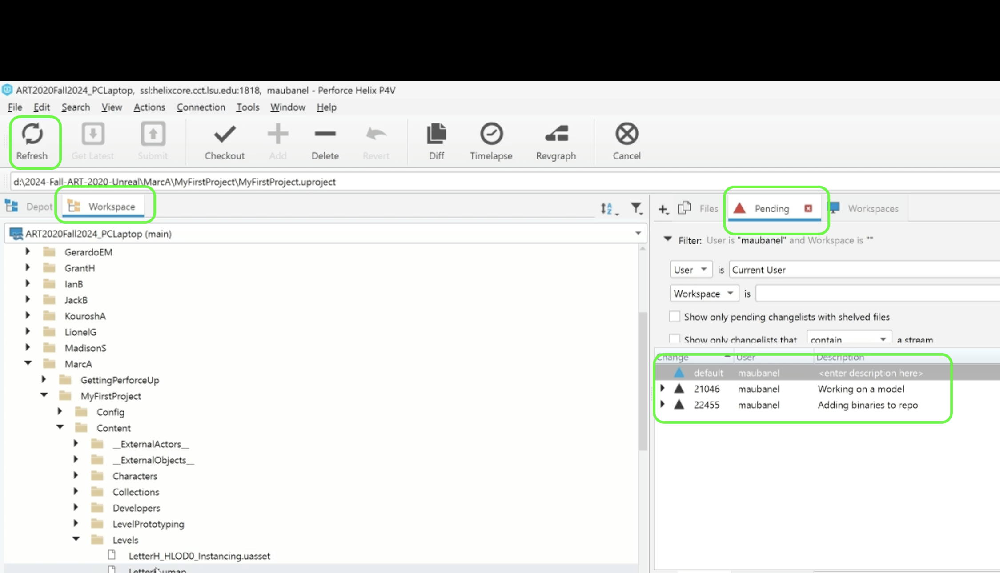
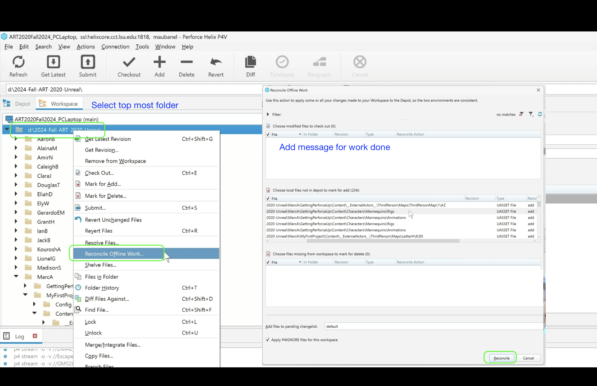
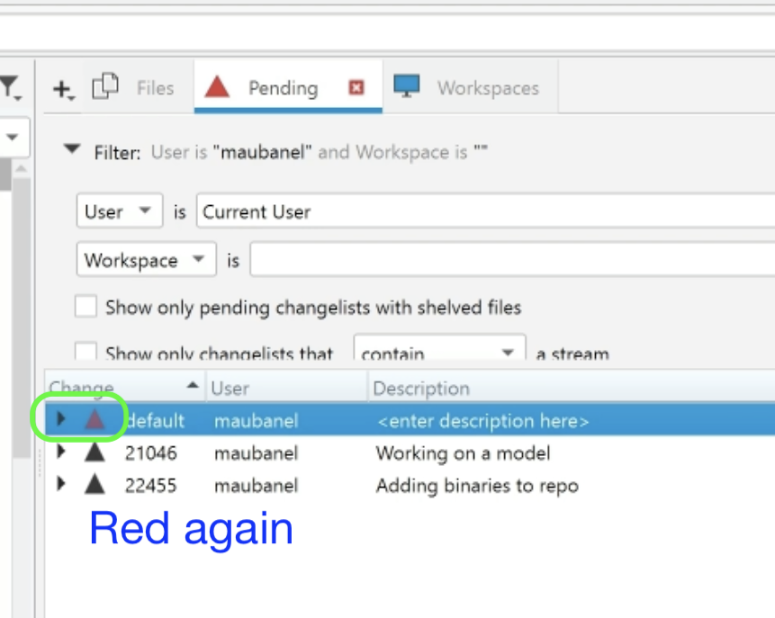
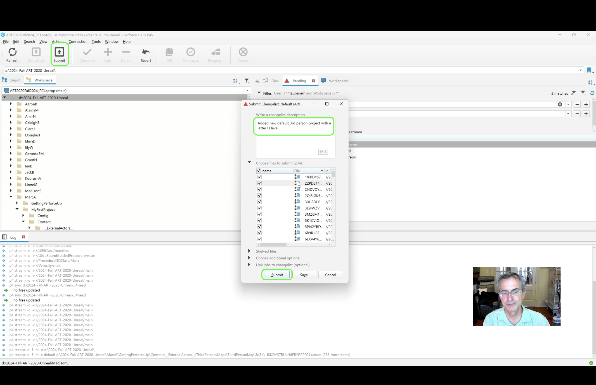

### Ending a Session in UE5 using Perforce

[home](../README.md#user-content-ue4-hello-world)

When we finish a session in Perforce we can submit everything in **P4V** or use a combination of the **Unreal** tools as well as **Perforce** to make sure that our work is all pushed to the server.

https://github.com/user-attachments/assets/2adc4a32-6425-4917-9187-e8553aae63ac

 

---

##### `Step 1.`\|`P4VUE5`|:small_blue_diamond:

Press **File | Save All** to save all of your work.  Make sure there is nothing unsaved in your project.  We want to check everything into the Perforce server.

##### `Step 2.`\|`P4VUE5`|:small_blue_diamond: :small_blue_diamond: 

Once you are sure everything is saved select at the bottom right **Revision Control | Submit Content**. The type a detailed description of the work done.  It is best to submit after each task is complete so that your message can be short and accurate.  It is critical to leave a good message as you might need to go back and undo a change, or fix a but so a good description is essential. Double check that you in fact want to update all of the files.

When you are happy press the **Submit** button and then quit Unreal.

##### `Step 3.`\|`P4VUE5`|:small_blue_diamond: :small_blue_diamond: :small_blue_diamond:

Go back to **P4V** and go to the **Pending** tab.  Press the **Refresh** button and make sure that the arrows are only `blue` or `black` (black is other computers changelists and blue are changelists that are up to date with the depot.  If it was not up to date the arrow next to the **default** changelist would be red.  In this case it is blue.

##### `Step 4.`\|`P4VUE5`|:small_blue_diamond: :small_blue_diamond: :small_blue_diamond: :small_blue_diamond:

Now there is one final step.  Many times Unreal is not aware that files have changed and it will not get submitted to Perforce.  So we are out of sync and if you go to another computer it will not be correct. You need to make sure that all files are updated.  To do this go to the very top folder and right click and choose **Recondile Offline Work...**.  If it comes up empty then press OK and you are finished.  If there are files to reconcile then add a message with what the files were for and press the **Reconcile** button and then you will notice that the changelist goes red (You might have to refresh).

##### `Step 5.`\|`P4VUE5`| :small_orange_diamond:

Select your outstanding pending list and press the **Submit** button. Make sure you are happy with your description then press the **Submit** button. Now it is a good idea to go to the **Depot** tab and make sure that one of the files you just updated actually did nake it to the server.  Now you can finish your session knowing that you or the next person will be able to get the latest from any other workspace on any computer.

| [home](../README.md#user-content-ue4-hello-world) | 
|---|
