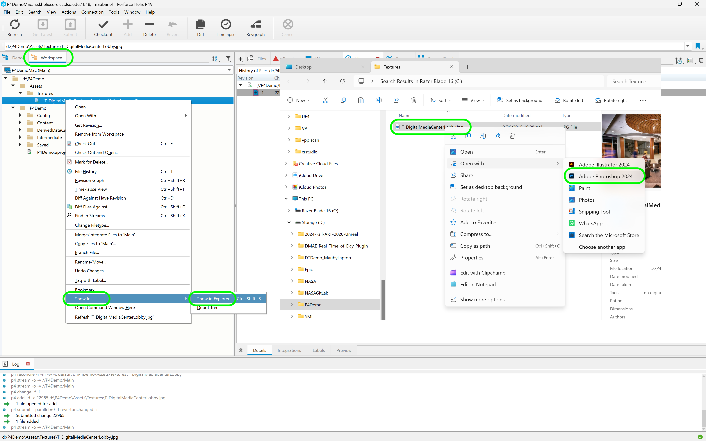
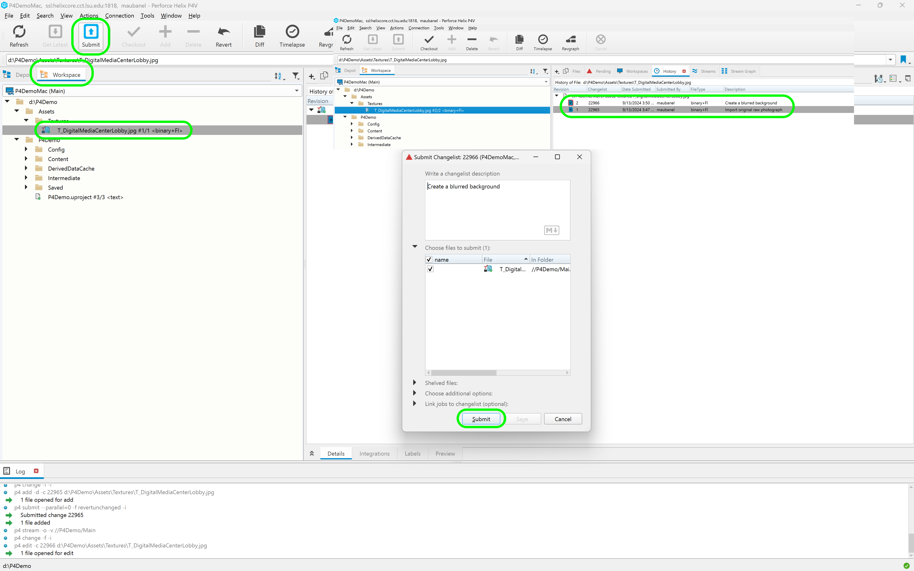

### Creating Raw Assets for Games using Perforce

[home](../README.md#user-content-ue4-hello-world)

We not ony use Perforce for the game project but for every single asset no matter how small that goes into making the game.  If you have not created assets in Perforce before this requires a change in how you work and to trust the version control to allow for maximum creative flexibility. 

You can watch it on [YouTube](https://www.youtube.com/watch?v=MGEVi9CsQtY).

 

---

##### `Step 1.`\|`P4VUE5`|🔹

I normally create a folder next to the Unreal project called **Assets** that holds all the source files we use to make the game.  I made added **Textures** folder and added a photograph (any image will do here).

##### `Step 2.`\|`P4VUE5`|🔹🔹

Here is what the original photo looks like.

##### `Step 3.`\|`P4VUE5`|🔹🔹🔹

I want to commit this at every step of the way. So in **P4V** go to the **Assets | Textures** folder and highlight the image.  Press the **+ Add** button and enter a message for the pending changelist.  I typed `Import original raw photograph`.

Finish submitting by pressing the **Submit** button.  We want to submit at EVERY stage as this gives us maximum ability to undo to any point in our history.

##### `Step 4.`\|`P4VUE5`|🔹🔹🔹🔹

Now Perforce will maintain a history of the file.  There is no need to number a file such as `T_File01`, `T_File02` etc...  We can just use one name and only have to hold the latest file on our hard drive.  Every other version will be saved on the server.

To see the history select **View | History** and select the file.  You can see it has a single entry of our initial submission.

##### `Step 5.`\|`P4VUE5`| 🔸

Now lets make a change to the file.  Lets for example blur it and use it as a background.  I double click and tried to load the file but it went to a windows photo editing app.  I want to edit it in Photoshop.

I right click in **P4V** on the file and select **Show In | Show In Explorer**. Then I right click and open the file with **Photoshop**. 

##### `Step 6.`\|`P4VUE5`| 🔸🔹

Add a **Filter | Blur | Gaussian Blur** of strength `25` to blur the image. 

##### `Step 7.`\|`P4VUE5`| 🔸🔹🔹

Now go and try and save the file.  You get an error stating you don't have the access permission.  This is how **Perforce** works.  You cannot work and save on a file unil you check it out. All files are **Read Only** by default. 

Go back to the file in explorer and select **Properties**.  Notice that it is in fact **Read Only**.   DO NOT CHANGE THIS IN EXPLORER.

##### `Step 8.`\|`P4VUE5`| 🔸🔹🔹🔹

So to write to the file you need to check it out.  Go back to **P4V** and make sure you are on the **Workspace** (local hard drive) and select the `jpg` and press the **Checkout** button.  Select a **New Changelist** and add a description `Create a blurred background`.  

Now go back to **Photoshop** and you can now succesfully press **File | Save** and it saves the blurred file.

##### `Step 9.`\|`P4VUE5`| 🔸🔹🔹🔹🔹

Now your local hard drive has the latest version.  But the server just has the one original version of the photograph.  You need to be on the **Workspace** in **P4V** and select the `jpg` file and press the **Submit** button.

This will submit it to the server.  Now in the **History** tab you can see that the server maintains the entire history and has a reference to both versions.

##### `Step 10.`\|`P4VUE5`| 🔷

Now everything in Perforce is a non destructive workflow.  So we can go back in time and recover prior work.  It is like having unlimited undo's. The more we commit to the server the more fine grained ability we have to back in time.

I can even delete a file and recover it later on as even deleting is non destructive.  It will delete it locally but not on the server.  You DO NOT delete it in **Explorer** like you normally would.

Go to **P4V** and select the `jpg` file and press the **- Delete** button.  Then select a **New** change list with a description such as `Delete lobby background no longer needed`. Press the **Ok** buton.

##### `Step 11.`\|`P4VUE5`| 🔷🔹

Now the file is not yet deleted.  You need to go to the **Changelist** and press the **Submit** button. Now the file disappears from the **Workspace** (local hard drive) and it looks like it disappears from the **Depot** (server).

But it is still there.

##### `Step 12.`\|`P4VUE5`| 🔷🔹🔹

In the **Depot** select the filter drop down and select **Show Deleted Depot Files**.  Then all of a sudden the file reappears and if you hover on it you get a message saying `deleted at head revision`.  The head revision is the latest version on the server.  So the history of the file is preserved but it is not sent to your workspace as it is now considered removed from the **head** of the project.

##### `Step 13.`\|`P4VUE5`| 🔷🔹🔹🔹

So what is the benefit of a non-destructive workflow?  We can go back in time. On the **Deport** tab select the deleted file and right click and select **Undo Changes...**. 

This will bring up a menu. We do not want to select **Undo a single change** or **Undo a range of changes**. These would be appropriate for text files as it can combine multiple versions.  

Since a photo is a binary, it can't combine individual changes.  All we can do is return to a prior version.  So select **Undo all changes from the selected point to the most recent version**.

We want to recover the original first un-blurred photograph. So we undo all changes from **Revision 2** until the end. This will effectively undo revision 2 & 3 and return to the 1st version.  Press the **Submit** button. 

This will bring up with a filled in description which we can leave.  Press the **Submit** button to lock this change in which will download the file from the server to your local hard drive.

##### `Step 14.`\|`P4VUE5`| 🔷🔹🔹🔹🔹

Now in your **Workspace** the file reappears.  If you open it up it is now the original un-blurred version as we requested.

##### `Step 15.`\|`P4VUE5`| 🔷🔸 

Now we can go back again to any point in our history.  If we want to go back to the blurred version we can easily do this.  On the **Workspace** we right click on the `jpg` and select **Undo Changes...**.

We then select **Undo changes from a selected point to the most recent version**.  This time we want to undo from **Revision 3** forward (which is the deletion we made after we blurred it).  Press the **Submit** button and keep the default description and press **Submit** again.  Now open the file and notice that we are back to the blurred version!

##### `Step 16.`\|`P4VUE5`| 🔷🔸🔹

Go to **P4V** and in the **Workspace** checkout the `jpg`.  Add a **New** changelist and add a description `Add the number 2 to foreground`. 

Now open the file up in **Photoshop and add the number 2 to the foreground.  Press **File | Save**.

##### `Step 17.`\|`P4VUE5`| 🔷🔸🔹🔹

Submit the changelist to the server to update the history to include this third change to the photograph.

##### `Step 18.`\|`P4VUE5`| 🔷🔸🔹🔹🔹

Now lets repeat and make a final change.  Check the `jpg` out and add the number 3 to the photo. Save and submit the change to the server.

##### `Step 19.`\|`P4VUE5`| 🔷🔸🔹🔹🔹🔹

Now one added feature of the history tab is that we can open up older versions (will download it from the server). Go back to **P4V** and select the **Workspace** and selet the `jpg`.  Select the **History** tab and double click on any change in history (except for deletion) and it will load up that version.  In the below screenshot I select revision 2 the blurred photo with no numbers.

Please note this is not changing anything on your local drive just a way of looking at the history. It is not undoing anything.

##### `Step 20.`\|`P4VUE5`| 🔷🔷

Now we can actually temporarily load a file and replace the active one in our project. Right click in the **History** tab on **Revision** 2 and select **Get This Revision**. This will now replace the latest version with an older one. 

##### `Step 21.`\|`P4VUE5`| 🔷🔷🔹

Now instead of a permanent change it just brings in version 2 into the project. No one else will see this you will only see it locally.  I use this sometimes to cut and paste a single element from an older version that I can paste back into the latest version.  Don't forget to undo this or you will be out of sync with the rest of the team.

##### `Step 22.`\|`P4VUE5`| 🔷🔷🔹🔹

Right click on the `jpg` file and select **Get Latest Revision** to go back to the head of the project with this file which brings back the latest version with number 23. 

Hopefully this shows you one way of effectively using source control to work even on your own and allow for maximum creative flexibility.

| [home](../README.md#user-content-ue4-hello-world) | 
|---|
