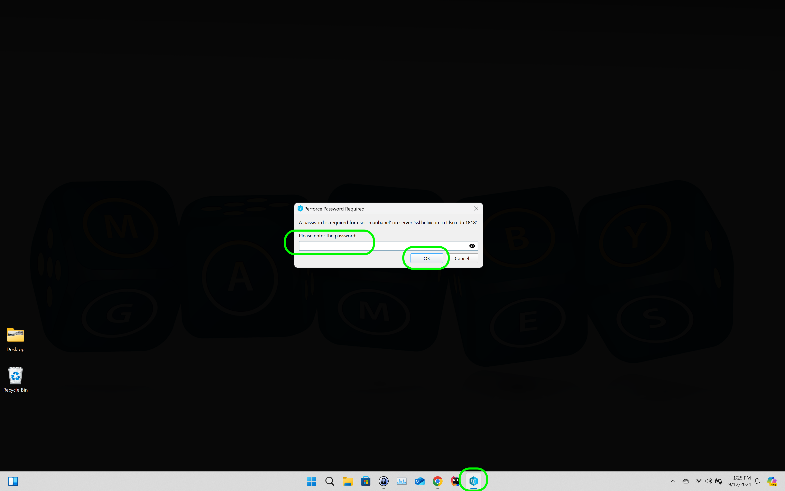
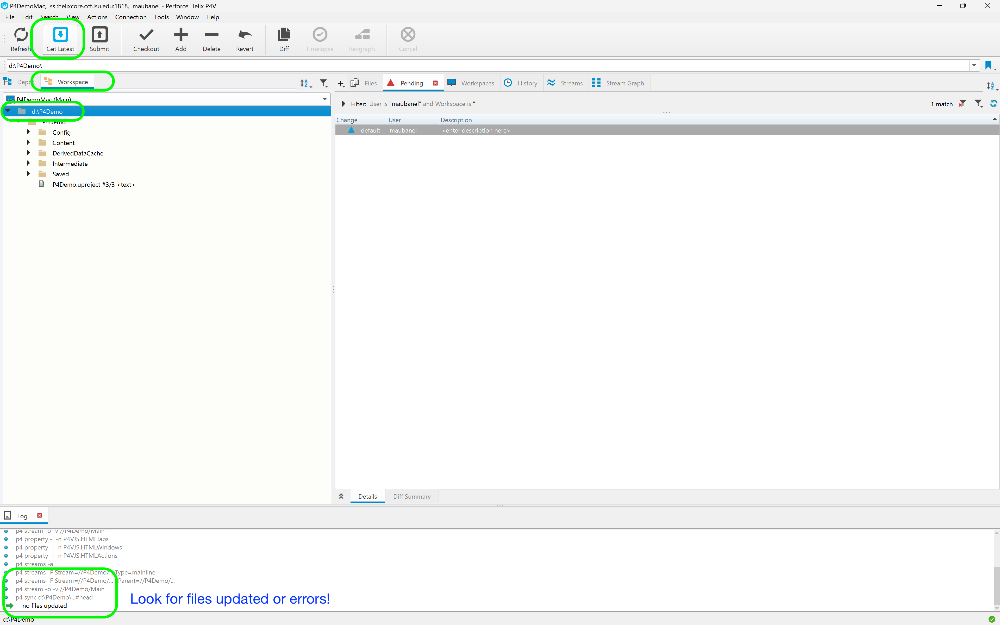
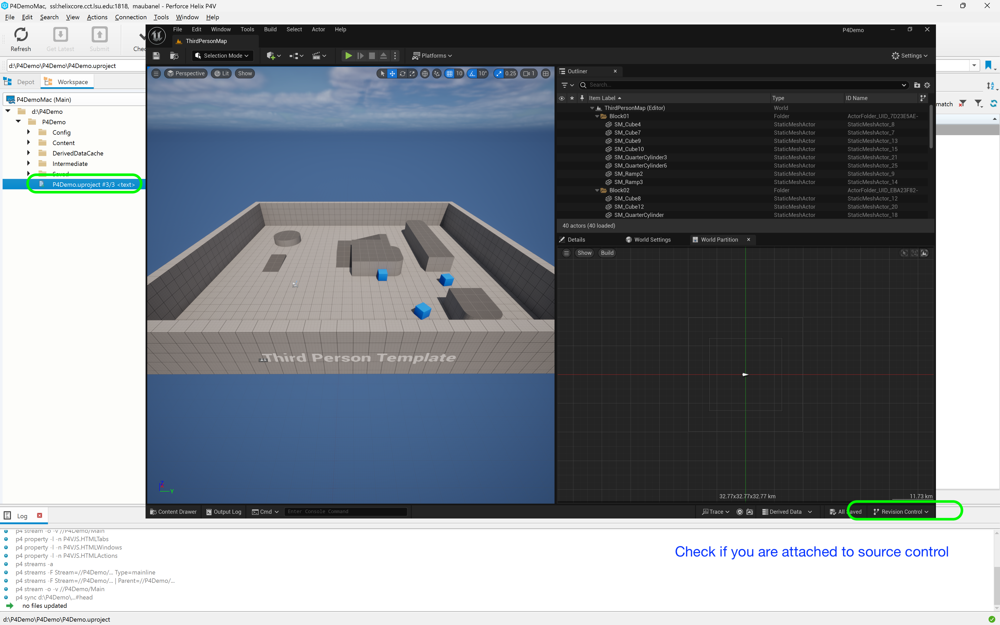

### Starting a Session in UE5 using Perforce

[home](../README.md#user-content-p4v)

Here is the procedure for starting a session in **Unreal** using **Perforce**. This should only be used when you have an existing [workspace](https://github.com/maubanel/p4v-unreal/blob/main/workspaces/README.md#user-content-workspaces-in-p4v) with your [environment variables](https://github.com/maubanel/p4v-unreal/blob/main/environment/README.md#user-content-set-up-environment-variables) correctly set up.

 

---

##### `Step 1.`\|`P4VUE5`|:small_blue_diamond:

Launch **P4V** and enter your password.  The default setting for the server is 24 hours so you will have to re-enter your password at least once a day. Press **OK** to load up Perfroce.

##### `Step 2.`\|`P4VUE5`|:small_blue_diamond: :small_blue_diamond: 

Now go into the **Workspace** you want to work in.  Make sure you are on the **Workspace** tab as we want to update what is on your local hard drive with the latest from the server. 

Select the top most folder and press the **Get Latest** button. This will get the latest from the server - make sure there are no errors in your log.  If you are not connecting with the server or there are file conflicts this will show up in the log window.

##### `Step 3.`\|`P4VUE5`|:small_blue_diamond: :small_blue_diamond: :small_blue_diamond:

Double click and launch the `.uproject` Unreal project file from Perforce.  This is not necessary, it is just a step I take to remember to be logged into Perforce before running Unreal and using the right Workspace.

If everything is correct with your **Saved** and `.p4config` file you should already be logged into Perforce and ready to start. 

##### `Step 4.`\|`P4VUE5`|:small_blue_diamond: :small_blue_diamond: :small_blue_diamond: :small_blue_diamond:

If you are not connected to Perforce and select **Revision Control** and **Connect to Revision Control...**.  Set the server to **Perforce** then set your username, password and workspace.  Press the **Accept Settings** button. Then you should have a green check mark on the **Revision Control** tab on the bottom right.

You are ready to start your session.  That is all it takes to get up and running for a session in Unreal using Perforce!

| [home](../README.md#user-content-p4v) | 
|---|

