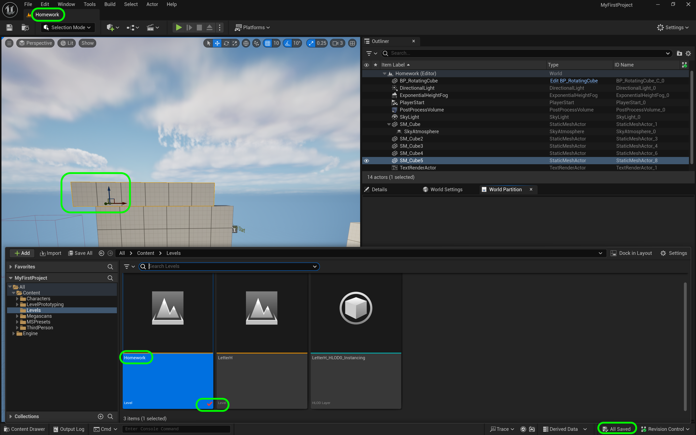
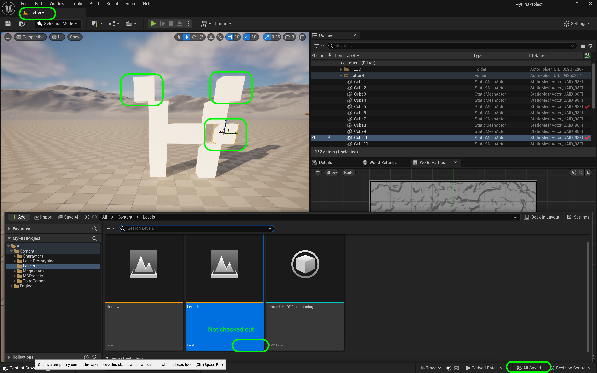
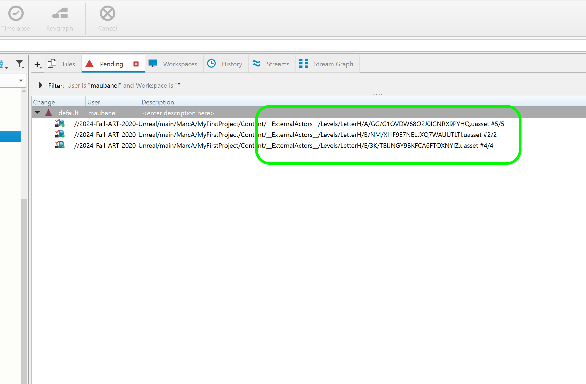
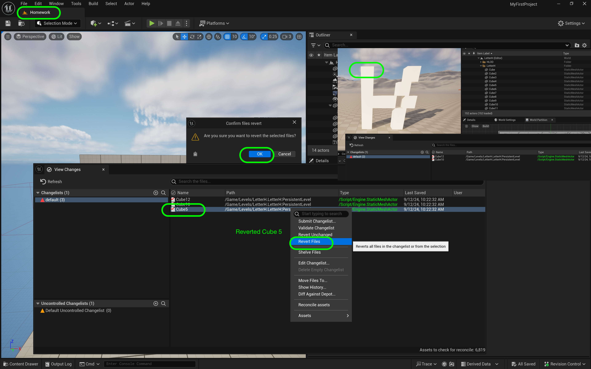
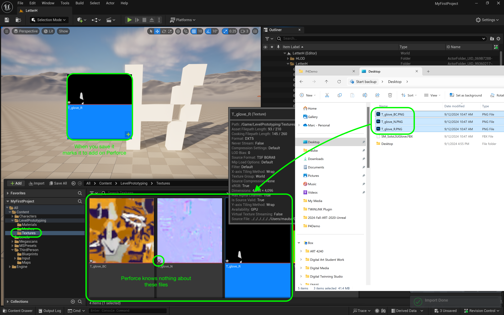
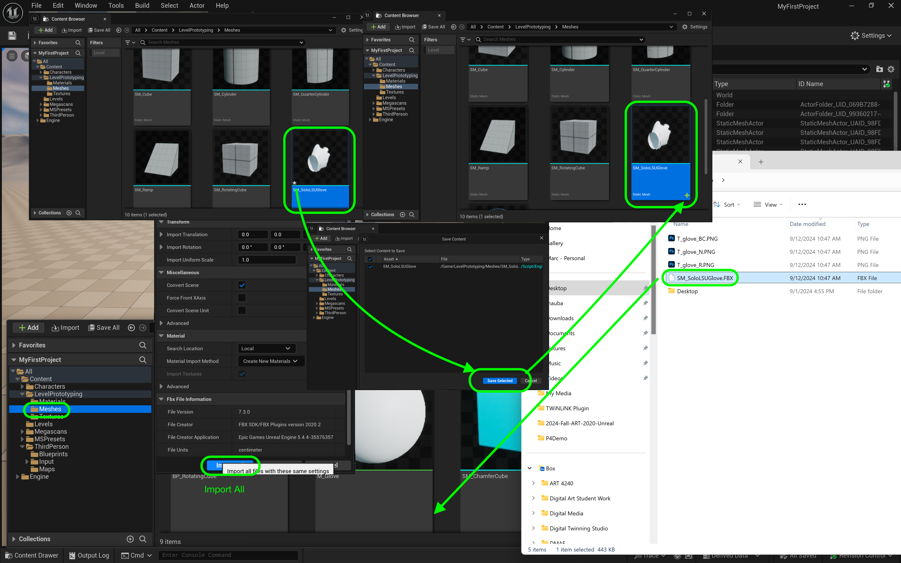
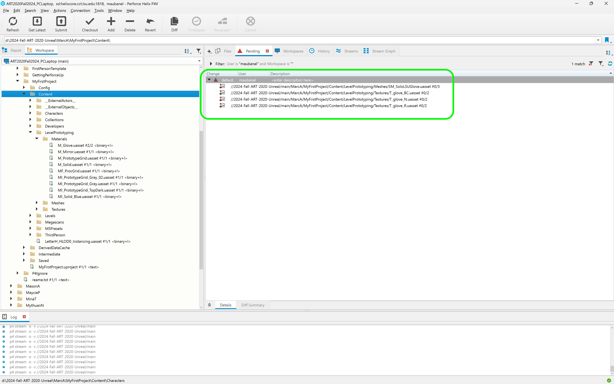
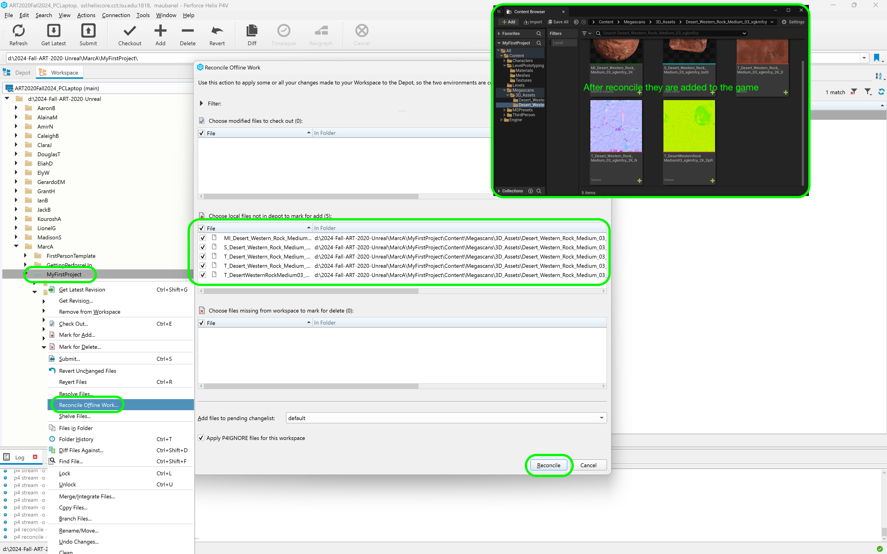

### Using Perforce in UE5

[home](../README.md#user-content-ue4-hello-world)

This guide is for daily use of UE5 and the appropriate workflow. You can follow the instructions below or watch a [video on YouTube](https://youtu.be/XCuE6wfNCF8)

 

---

##### `Step 1.`\|`P4VUE5`|🔹

It is best practice to have **P4V** running when working in **UE5**.  To make sure you are doing this, it is good to launch the game from within the **P4V** interface.  Highlight the folder that holds your `.uproject` and press the <kbd>Get Latest</kbd> button. This will get the latest version of the game that is on the **Depot**. Double click on the `.uproject` within **P4V** to open the project from **P4V**.

##### `Step 2.`\|`P4VUE5`|🔹🔹

If you have not set up automatic checkout out of files do it now!  This is only saved locally on the current machine and does not get shared across the project.  You will need to set this on each workstation you use. 

Now one of the advantages of how **Perforce** is configured is that it won't allow for two people to save to the same file (unless they are text files). This is very convenient as it will reduce the amount of collisions when working as a team.  

What we don't want is to edit a level for 3 hours then when we go to save it find out that someone else has it checked out.  We can avoid this by automatically checking out a file when it is edited.  

Go to **Edit | Edtior Preferences** and select **General | Loading & Saving** and turn on **Automatically Checkout on Asset Modification**.

##### `Step 3.`\|`P4VUE5`|🔹🔹🔹

If you have a green check mark on Source Control you can skip to step 6 (bottom right of the editor). 

If there is not a green check markNow then select it and choose **Connect to Source Control** to bring up the source control menu and then select **Perforce** from the list.

##### `Step 4.`\|`P4VUE5`|🔹🔹🔹🔹

Now we enter the provider as **Perforce**, the **Server** as `ssl:helixcore.cct.lsu.edu:1818`, the user name and the workspace. To select the workspace select the **Available Workspace** list and all available workspaces will show up. Press the <kbd>Accept Settings</kbd> button.

##### `Step 5.`\|`P4VUE5`| 🔸

If the settings were correct a pop up will briefly appear at the bottom right saying the connection was successful.

##### `Step 6.`\|`P4VUE5`| 🔸🔹

Now if I edit a file such as this material, it will automatically checkout the file.  In this case I am changing a blue material to pink. A red check mark will appear in **Content Drawer**.  Unreal has checked this out of Perforce which changes the file to writable - so Unreal can save over that file.

If it doesn't get the red check mark or someone else has it checked out you will not be able to save over this file.  

Never select **Make Writable** as you will create an unresolvable conflict.  You cannot merge two binary files that multiple people have changed.

Only one person can change a file at a time.

##### `Step 7.`\|`P4VUE5`| 🔸🔹🔹

This effectively does the same thing as checking out that file in **P4V**.  It is just easier and quicker to do it through the Unreal Engine which is tightly integrated with Perforce. 

But you will notice that the file is marked as checked out.  This will appear in the entire team's Perforce workspace.  So only that one person can save and work with `MI_Solid_Blue.uasset`.

##### `Step 8.`\|`P4VUE5`| 🔸🔹🔹🔹

Now that you have done this work, what if you want to change it back.  You have saved it and maybe you can no longer undo (or your undo chain is not long enough)?  You can right click on the file then select **Revision Control | Revert**. Confirm the file(s) to revert then press the **Revert** button on the pop-up confirmation.

##### `Step 9.`\|`P4VUE5`| 🔸🔹🔹🔹🔹

Confirm the revert by pressing the **Yes** button.

##### `Step 10.`\|`P4VUE5`| 🔷

Now the material has reverted back to its original blue color.  Note that reverting is a destructive change.  So **Perforce** does not keep a history of reverts.  If you think you might go back then you can just change it manually back to blue and it will keep the prior pink version in the history that you can use later.

##### `Step 11.`\|`P4VUE5`| 🔷🔹

For objects in the **Content Drawer** the above procedure works fine.  For instances in levels there are two modes that **Unreal** works in which affects **Perforce** source control.

Levels that use **World Partition** automatically have **One File Per Actor** (OFPA) turned on by default. Basic non-world partition levels do not.  More information can be found in [Unreal's Manual](https://dev.epicgames.com/documentation/en-us/unreal-engine/one-file-per-actor-in-unreal-engine).

If you want to know if it is turned on or not then select **Window | World Partition | World Partition Editor**.  If you see `world partition is disabled for this map` then world partition is not turned on.

##### `Step 12.`\|`P4VUE5`| 🔷🔹🔹

So if one actor per file is turned off then a level is like any other asset.  Only one person can work on a level at a time.  The second you make a change you will check out the map/level and no one else on the team will be able to work on the level you are editing.

You are able to turn on one file per actor (OFPA) on any level manually.  Follow the [directions](https://dev.epicgames.com/documentation/en-us/unreal-engine/one-file-per-actor-in-unreal-engine).

Since game levels are getting larger and larger, having the ability for multiple people to work on it at the same time is critical.

##### `Step 13.`\|`P4VUE5`| 🔷🔹🔹🔹

Now if you have **OFPA** turned on (either by default or after the fact) you have my prefered workflow.  When you are editing a level you are NOT checking out hte level.  Below I shifted the blocks on the letter **H**. Notice that it DID NOT check the level out.

##### `Step 14.`\|`P4VUE5`| 🔷🔹🔹🔹🔹

Now you will notice that **Unreal** saves each file as a hashed name (cryptic) in the **_External Actors** folder which you will not see in the **Content Browser**.

##### `Step 15.`\|`P4VUE5`| 🔷🔸

Unreal warns that you HAVE to submit these files through the editor and NOT through P4V. 

##### `Step 16.`\|`P4VUE5`| 🔷🔸🔹

If you want to revert you have to leave the level then revert the changes you want.  Then you can return to the level and continue on. In the below example I undid **Cube 5** on the left hand side of the **letter H**.

##### `Step 17.`\|`P4VUE5`| 🔷🔸🔹🔹

Lets look at what happens when we add a new file to Unreal.

Download the fbx of [a football glove](../files/ue5/SM_SoloLSUGlove.FBX), [base color texture](../files/ue5/T_glove_BC.PNG), [normal map](../files/ue5/T_glove_N.PNG) and [roughness](../files/ue5/T_glove_R.PNG) map. 

Drag and drop the .png files into the **LevelPrototyping | Textures** folder. Now you will see that the files have an **asterix** next to its icon.  This means that **Perforce** knows nothing about this file.  If you hit **Save** you will have it **Added** to **Perforce** (like pressing the **Add** button). Now the icon changes to a **Plus** symbol which means that Perforce recognizes this as a file it doesn't have in its database and needs to add it.

##### `Step 18.`\|`P4VUE5`| 🔷🔸🔹🔹🔹

Do the same thing with the mesh and add **SM_SoloLSUGLove** to the **Level Prototyping | Meshes** folder.  Accept the default settings and press **Import All**. Now the icon goes from an **asterix** to a **+** when you press **Save**>

##### `Step 19.`\|`P4VUE5`| 🔷🔸🔹🔹🔹🔹

It has been now staged to add to **Perforce**.

##### `Step 20.`\|`P4VUE5`| 🔷🔷
Now lets look at the last method for adding assets to our projects that exposes a potential weakness.  Go to the **Add Asset** button and select **Quixel Bridge**.  Log into Quixel using your Unreal account. Select an assets and press the **Download** and **Add** buttons.  This will download it to your hard drive then add it to this project.

##### `Step 21.`\|`P4VUE5`| 🔷🔷🔹

Now if we press **Save All** we are still getting a question mark on the asset added.  These should have a **+** icon.  This means that **Unreal** and perforce did not communicate when importing these assets into the project.  So it is there in your directory but Perforce doesn't know about it.

##### `Step 22.`\|`P4VUE5`| 🔷🔷🔹🔹

Now you have to go to **P4V** and in the **Workspace** tab click the top most project folder and right click and select **Reconcile Offline Work**.  Then press the **Reconcile** button and it will add it to the changelist.  Now go back to the game and you will see that these files now have the **+** signs indicating that Perforce knows about them and will submit them when you press the **Submit** button.

This is a good example of why I ALWAYS do final reconcile as part of my [wrapping up](https://github.com/maubanel/p4v-unreal/blob/main/quitting-ue5/README.md#user-content-quitting-ue5-with-perforce) of any Unreal/Perforce work session. Make it a habit to check in of your work at the end of a session.  Otherwise any of the files will be locked for others to work on.  It is best etiquette to check everything back in before ending your session.

| [home](../README.md#user-content-ue4-hello-world) | 
|---|
