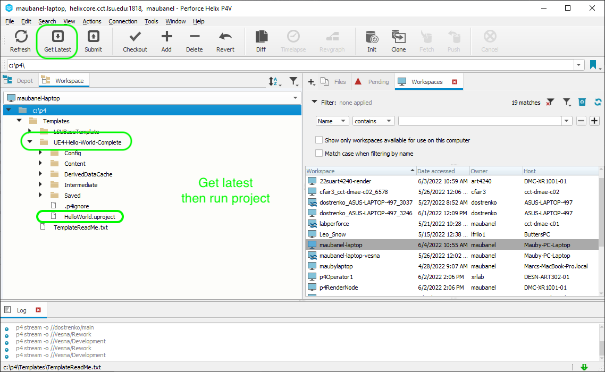
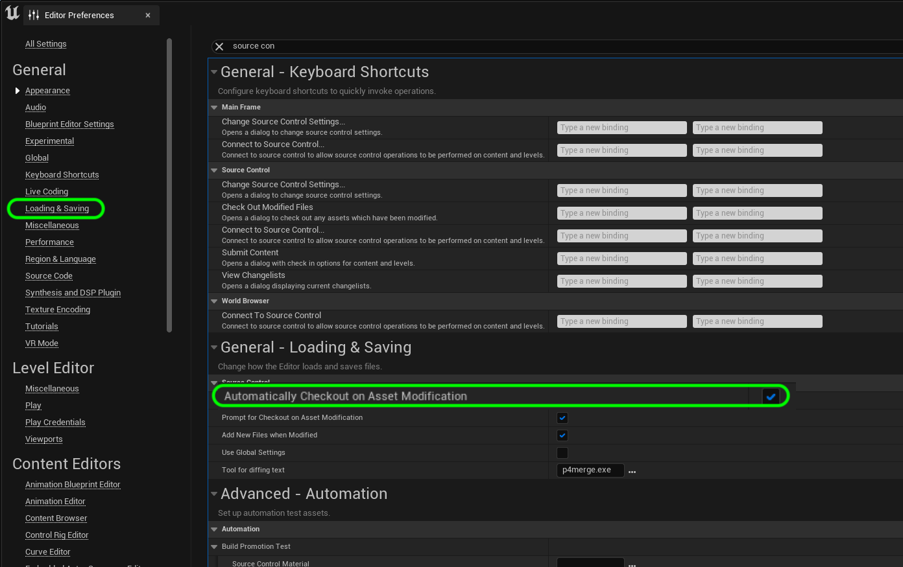
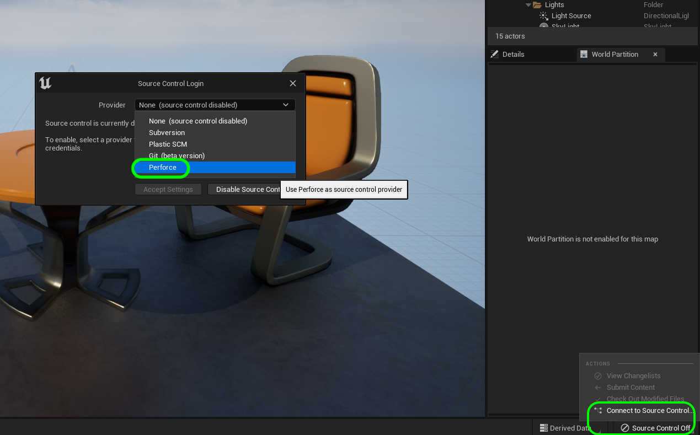
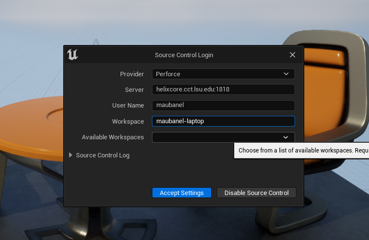
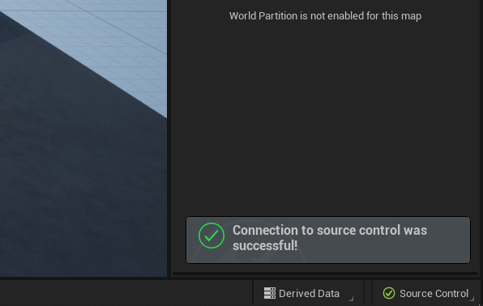
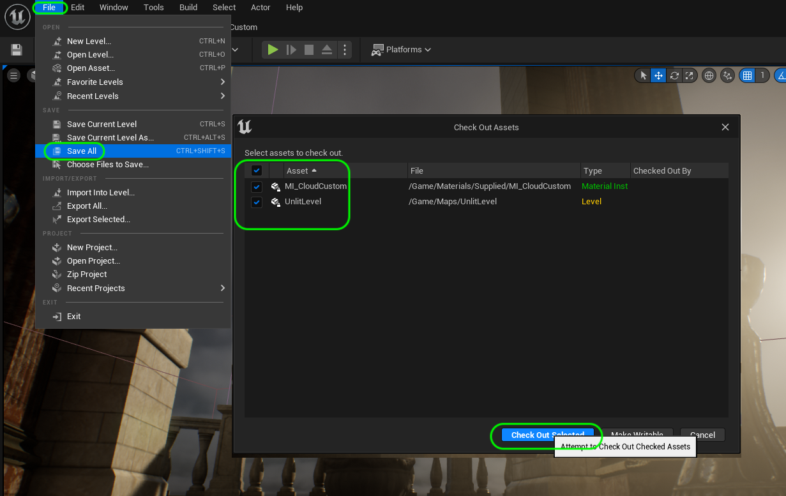
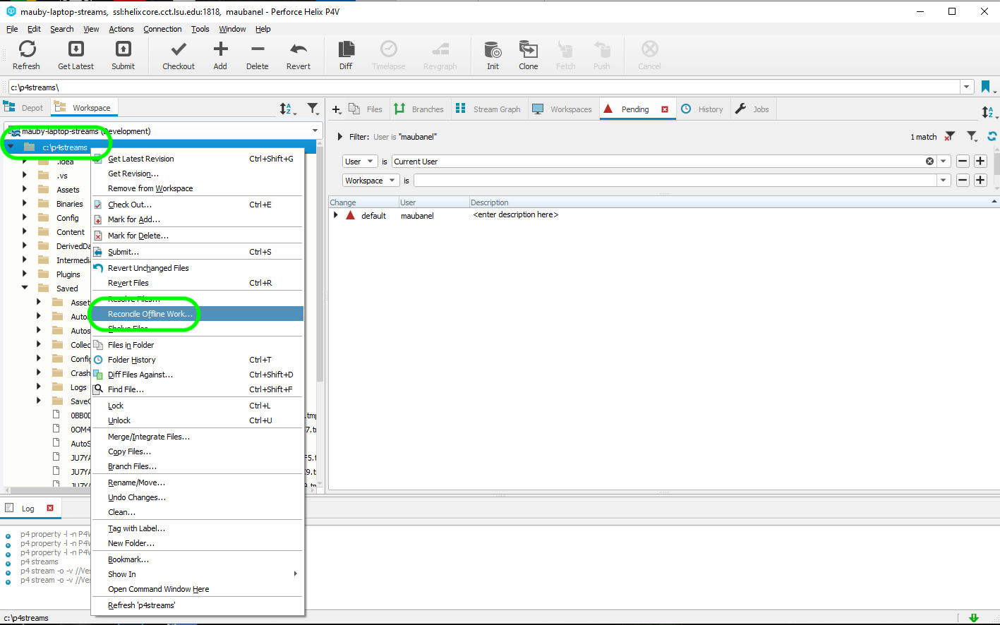
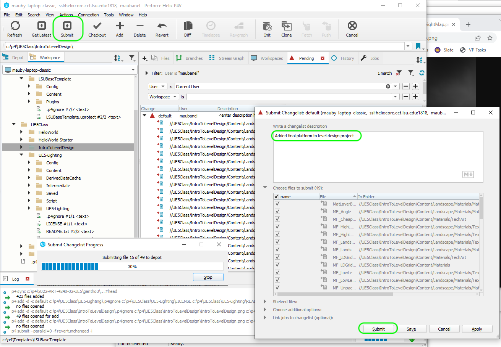
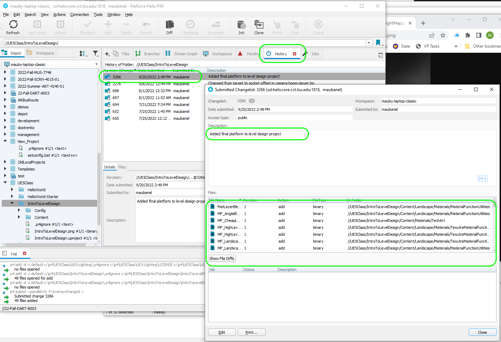

### Using Perforce in UE5

[home](../README.md#user-content-ue4-hello-world)

This guide is for daily use of UE5 and the appropriate workflow.

 

---

##### `Step 1.`\|`P4VUE5`|:small_blue_diamond:

It is best practice to have **P4V** running when working in **UE5**.  To make sure you are doing this, it is good to launch the game from within the **P4V** interface.  Double click on the `.uproject` within **P4V** to open the project.

##### `Step 2.`\|`P4VUE5`|:small_blue_diamond: :small_blue_diamond: 

If you have not set up automotic checkout out of files do it now!  This is only saved locally on the current machine and does not get shared across the project.  You will need to set this on each workstation you use. 

Now one of the advantages of how **Perforce** is configured is that it won't allow for two people to save to the same file (unless they are text files). This is very convenient as it will reduce the amount of collisions when working as a team.  

What we don't want is to edit a level for 3 hours then when we go to save it find out that someone else has it checked out.  We can avoid this by automatically checking out a file when it is edited.  

Go to **Edit | Edtior Preferences** and select **General | Loading & Saving** and turn on **Automatically Checkout on Asset Modification**.

##### `Step 3.`\|`P4VUE5`|:small_blue_diamond: :small_blue_diamond: :small_blue_diamond:

Now there is a small message on the bottom right stating that source control is not turned on.  Select it and choose **Connect to Source Control** to bring up the source control menu and then select **Perforce** from the list.

##### `Step 4.`\|`P4VUE5`|:small_blue_diamond: :small_blue_diamond: :small_blue_diamond: :small_blue_diamond:

Now we enter the provider as **Perforce**, the **Server** as `helixcore.cct.lsu.edu:1818`, the user name and the workspace. To select the workspace select the **Available Workspace** list and all available workspaces will show up. Press the <kbd>Accept Settings</kbd> button.

##### `Step 5.`\|`P4VUE5`| :small_orange_diamond:

If the settings were correct a pop up will briefly appear at the bottom right saying the connection was succesful.

##### `Step 6.`\|`P4VUE5`| :small_orange_diamond: :small_blue_diamond:

Do your work as you normally would.  At the very end of the session press the **File | Save All** selection.  To save the game. Now it may ask you to checkout files.  Unreal does check out (locks others including yourself on another computer) from editing these files until they are submitted back in the repository. Make sure you checkout all the files (tick marks selected).

##### `Step 7.`\|`P4VUE5`| :small_orange_diamond: :small_blue_diamond: :small_blue_diamond:

Now the first thing we are going to do is add all files that are not currently in the database that you added the project during your work session. Highlight the folder that holds your project (the folder with the `.uproject` file).  Press the <kbd>+ Add</kbd> button. Press the <kbd>OK</kbd> button. This will add the files to the pending changelist (which already contains the files that Unreal checked out).

##### `Step 8.`\|`P4VUE5`| :small_orange_diamond: :small_blue_diamond: :small_blue_diamond: :small_blue_diamond:

Now you need to press the <kbd>Submit</kbd> button the a submit pop up with all the changed and added files pops up.  Add a description of what work was done.  Be VERY specific and detailed here.  Press the <kbd>Submit</kbd> button when you are done.  A progress bar will appear.  Wait until it has completely finished before ending your session.

##### `Step 9.`\|`P4VUE5`| :small_orange_diamond: :small_blue_diamond: :small_blue_diamond: :small_blue_diamond: :small_blue_diamond:

If you select the **History** tab you will see that it has added this lates changelist.  If you double click on it, you can see all the files that you changes as well as your comment. Now this is safely on the depot and your **Pending** list **HAS** to be cleared and empty before you end your session.

| [home](../README.md#user-content-ue4-hello-world) | 
|---|
