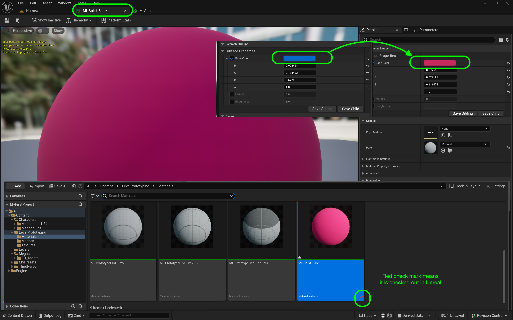
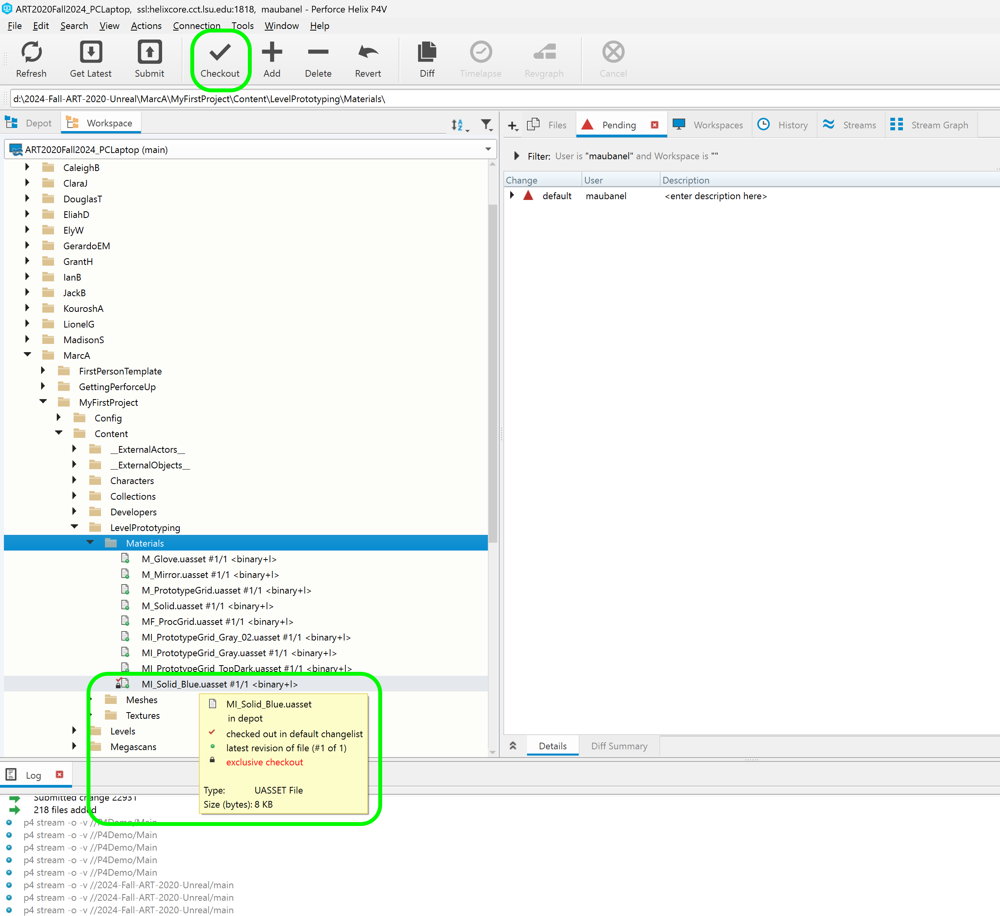
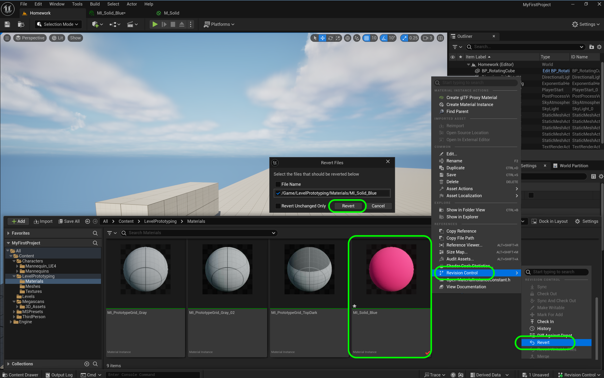
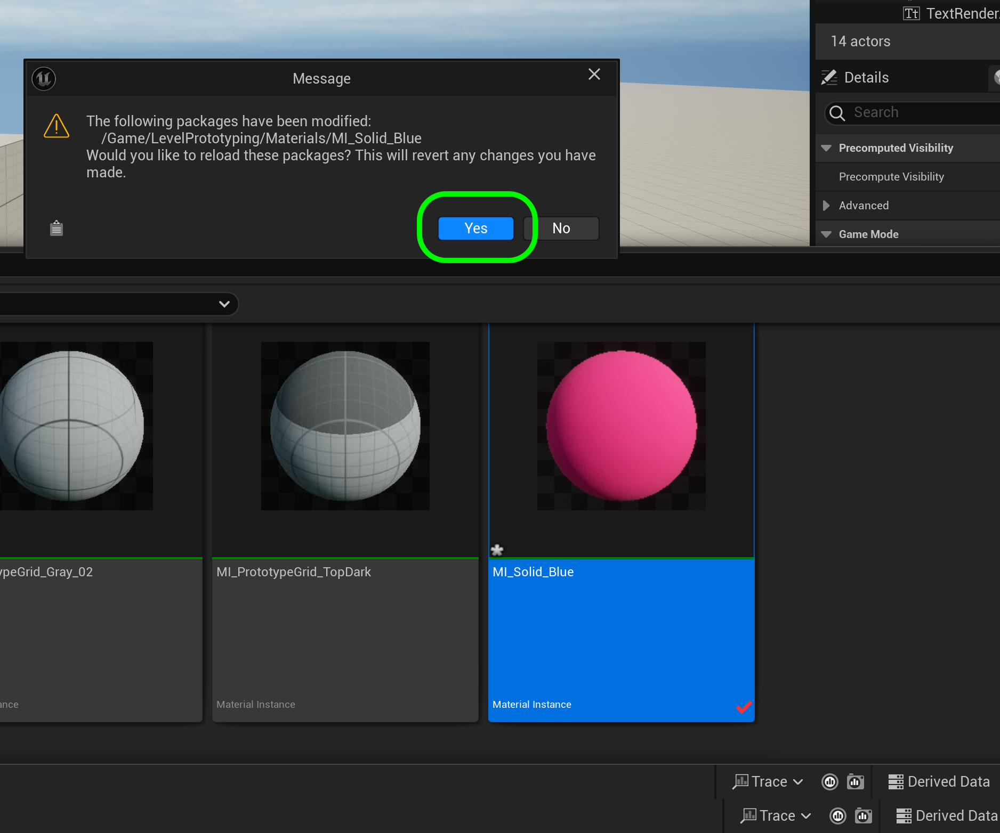

### Using Perforce in UE5

[home](../README.md#user-content-ue4-hello-world)

This guide is for daily use of UE5 and the appropriate workflow. You can follow the instructions below or watch a [video on YouTube](https://www.youtube.com/watch?v=w72pwjTnf3k)

 

---

##### `Step 1.`\|`P4VUE5`|:small_blue_diamond:

It is best practice to have **P4V** running when working in **UE5**.  To make sure you are doing this, it is good to launch the game from within the **P4V** interface.  Highlight the folder that holds your `.uproject` and press the <kbd>Get Latest</kbd> button. This will get the latest version of the game that is on the **Depot**. Double click on the `.uproject` within **P4V** to open the project from **P4V**.

##### `Step 2.`\|`P4VUE5`|:small_blue_diamond: :small_blue_diamond: 

If you have not set up automatic checkout out of files do it now!  This is only saved locally on the current machine and does not get shared across the project.  You will need to set this on each workstation you use. 

Now one of the advantages of how **Perforce** is configured is that it won't allow for two people to save to the same file (unless they are text files). This is very convenient as it will reduce the amount of collisions when working as a team.  

What we don't want is to edit a level for 3 hours then when we go to save it find out that someone else has it checked out.  We can avoid this by automatically checking out a file when it is edited.  

Go to **Edit | Edtior Preferences** and select **General | Loading & Saving** and turn on **Automatically Checkout on Asset Modification**.

##### `Step 3.`\|`P4VUE5`|:small_blue_diamond: :small_blue_diamond: :small_blue_diamond:

If you have a green check mark on Source Control you can skip to step 6 (bottom right of the editor). 

If there is not a green check markNow then select it and choose **Connect to Source Control** to bring up the source control menu and then select **Perforce** from the list.

##### `Step 4.`\|`P4VUE5`|:small_blue_diamond: :small_blue_diamond: :small_blue_diamond: :small_blue_diamond:

Now we enter the provider as **Perforce**, the **Server** as `ssl:helixcore.cct.lsu.edu:1818`, the user name and the workspace. To select the workspace select the **Available Workspace** list and all available workspaces will show up. Press the <kbd>Accept Settings</kbd> button.

##### `Step 5.`\|`P4VUE5`| :small_orange_diamond:

If the settings were correct a pop up will briefly appear at the bottom right saying the connection was successful.

##### `Step 6.`\|`P4VUE5`| :small_orange_diamond: :small_blue_diamond:

Now if I edit a file such as this material, it will automatically checkout the file.  In this case I am changing a blue material to pink. A red check mark will appear in **Content Drawer**.  Unreal has checked this out of Perforce which changes the file to writable - so Unreal can save over that file.

If it doesn't get the red check mark or someone else has it checked out you will not be able to save over this file.  

Never select **Make Writable** as you will create an unresolvable conflict.  You cannot merge two binary files that multiple people have changed.

Only one person can change a file at a time.

##### `Step 7.`\|`P4VUE5`| :small_orange_diamond: :small_blue_diamond: :small_blue_diamond:

This effectively does the same thing as checking out that file in **P4V**.  It is just easier and quicker to do it through the Unreal Engine which is tightly integrated with Perforce. 

But you will notice that the file is marked as checked out.  This will appear in the entire team's Perforce workspace.  So only that one person can save and work with `MI_Solid_Blue.uasset`.

##### `Step 8.`\|`P4VUE5`| :small_orange_diamond: :small_blue_diamond: :small_blue_diamond: :small_blue_diamond:

Do your work as you normally would.  At the very end of the unit of work you are workign is done press the **File | Save All** selection.  To save the game. Now it may ask you to checkout files.  Unreal does check out (locks others including yourself on another computer) from editing these files until they are submitted back in the repository. Make sure you checkout all the files (tick marks selected).

##### `Step 9.`\|`P4VUE5`| :small_orange_diamond: :small_blue_diamond: :small_blue_diamond: :small_blue_diamond: :small_blue_diamond:

Now that you have done this work, what if you want to change it back.  You have saved it and maybe you can no longer undo (or your undo chain is not long enough)?  You can right click on the file then select **Revision Control | Revert**. Confirm the file(s) to revert then press the **Revert** button on the pop-up confirmation.

##### `Step 10.`\|`P4VUE5`| :large_blue_diamond:

Confirm the revert by pressing the **Yes** button.

##### `Step 11.`\|`P4VUE5`| :large_blue_diamond: :small_blue_diamond:

Now the material has reverted back to its original blue color.  Note that reverting is a destructive change.  So **Perforce** does not keep a history of reverts.  If you think you might go back then you can just change it manually back to blue and it will keep the prior pink version in the history that you can use later.

##### `Step 12.`\|`P4VUE5`| :large_blue_diamond: :small_blue_diamond: :small_blue_diamond:

##### `Step 13.`\|`P4VUE5`| :large_blue_diamond: :small_blue_diamond: :small_blue_diamond:  :small_blue_diamond:

##### `Step 14.`\|`P4VUE5`| :large_blue_diamond: :small_blue_diamond: :small_blue_diamond: :small_blue_diamond:  :small_blue_diamond:

##### `Step 15.`\|`P4VUE5`| :large_blue_diamond: :small_orange_diamond:

##### `Step 16.`\|`P4VUE5`| :large_blue_diamond: :small_orange_diamond:   :small_blue_diamond:

##### `Step 17.`\|`P4VUE5`| :large_blue_diamond: :small_orange_diamond: :small_blue_diamond: :small_blue_diamond:

##### `Step 18.`\|`P4VUE5`| :large_blue_diamond: :small_orange_diamond: :small_blue_diamond: :small_blue_diamond: :small_blue_diamond:

##### `Step 19.`\|`P4VUE5`| :large_blue_diamond: :small_orange_diamond: :small_blue_diamond: :small_blue_diamond: :small_blue_diamond: :small_blue_diamond:

##### `Step 20.`\|`P4VUE5`| :large_blue_diamond: :large_blue_diamond:

| [home](../README.md#user-content-ue4-hello-world) | 
|---|
