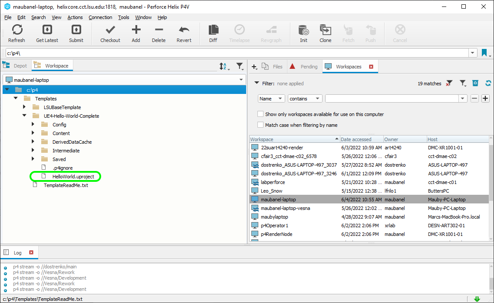
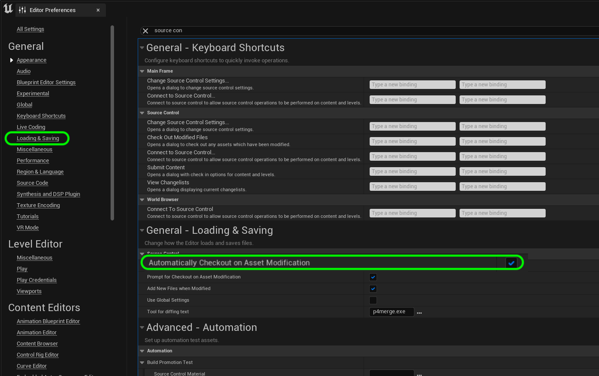
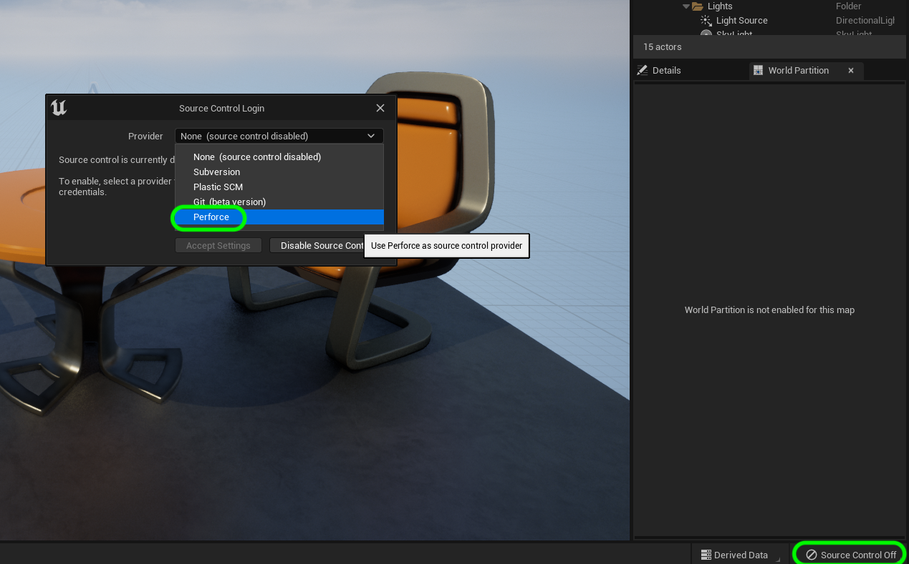
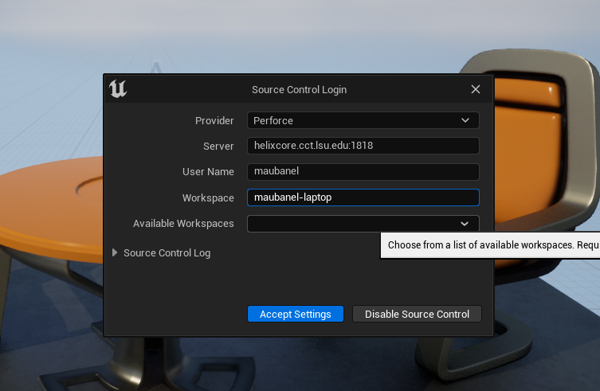
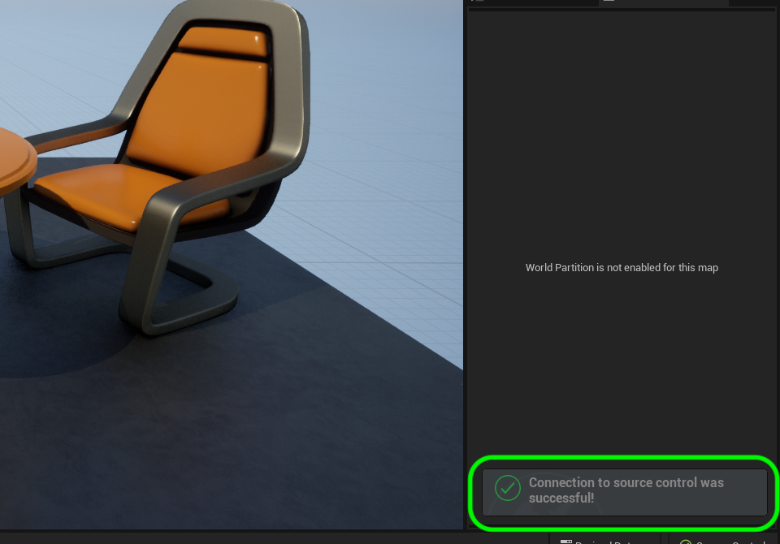
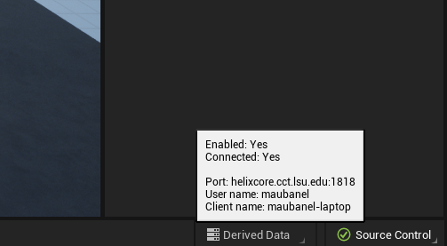
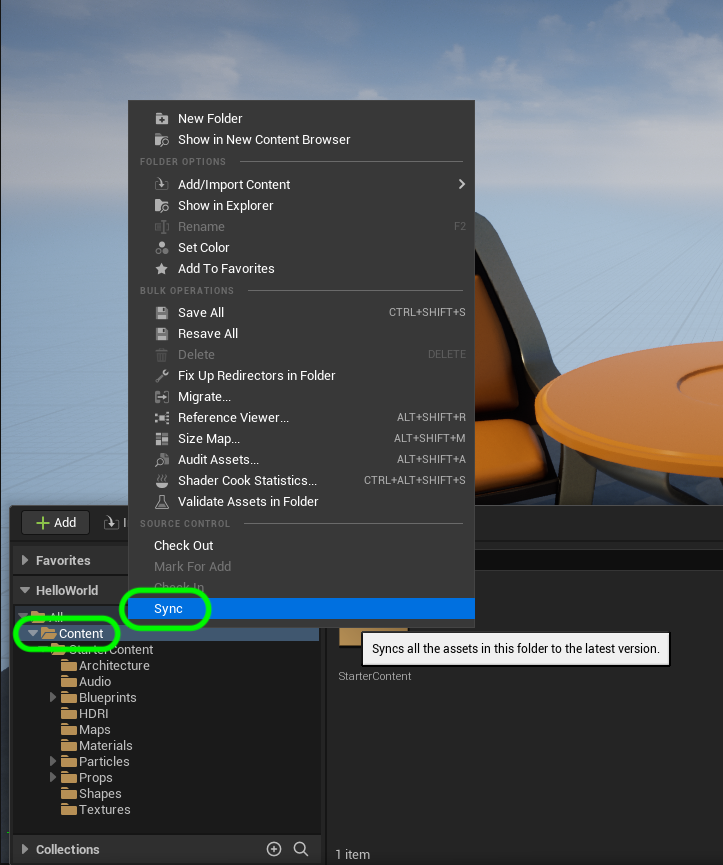

### Setting Up Perforce in UE5

[home](../README.md#user-content-p4v)

Unreal integrates **Perforce** into their workflow nicely.  They make it easy to use and it avoids conflicts with other team members when editing binaries. We can do most operations for version control inside of UE5.

 

---

##### `Step 1.`\|`BTS`|:small_blue_diamond:

It is best practice to have **P4V** running when working in **UE5**.  To make sure you are doing this, it is good to launch the game from within the **P4V** interface.  Double click on the `.uproject` within **P4V** to open the project.

##### `Step 2.`\|`BTS`|:small_blue_diamond: :small_blue_diamond: 

Now one of the advantages of how **Perforce** is configured is that it won't allow for two people to save to the same file (unless they are text files). This is very convenient as it will reduce the amount of collisions when working as a team.  

What we don't want is to edit a level for 3 hours then when we go to save it find out that someone else has it checked out.  We can avoid this by automatically checking out a file when it is edited.  

Go to **Edit | Edtior Preferences** and select **General | Loading & Saving** and turn on **Automatically Checkout on Asset Modification**.

##### `Step 3.`\|`BTS`|:small_blue_diamond: :small_blue_diamond: :small_blue_diamond:

Now there is a small message on the bottom right stating that source control is not turned on.  Select it and choose **Connect to Source Control** to bring up the source control menu and then select **Perforce** from the list.

##### `Step 4.`\|`BTS`|:small_blue_diamond: :small_blue_diamond: :small_blue_diamond: :small_blue_diamond:

Now we enter the provider as **Perforce**, the **Server** as `helixcore.cct.lsu.edu:1818`, the user name and the workspace. Press the <kbd>Accept Settings</kbd> button.

##### `Step 5.`\|`BTS`| :small_orange_diamond:

If the settings were correct a pop up will briefly appear at the bottom right saying the connection was succesful.

##### `Step 6.`\|`BTS`| :small_orange_diamond: :small_blue_diamond:

Now in the future if you boot up **Unreal** and it is saying it is connected to source control you can put your cursor on top and it will pop up to make sure you have the correct settings.

##### `Step 7.`\|`BTS`| :small_orange_diamond: :small_blue_diamond: :small_blue_diamond:

Now that we are set up.  It is best before starting in **UE5** to sync with the **Perforce** server and get the latest.  Press the <kbd>Content Drawer</kbd> and right click on the **Content** folder and select `Sync`. Now you are ready to begin.

| [home](../README.md#user-content-p4v) | 
|---|
