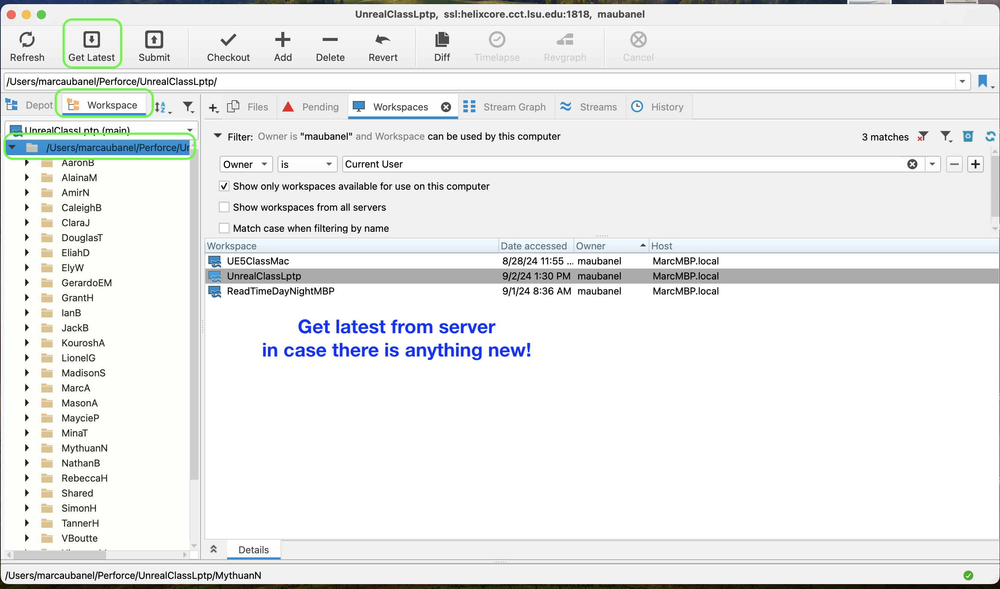
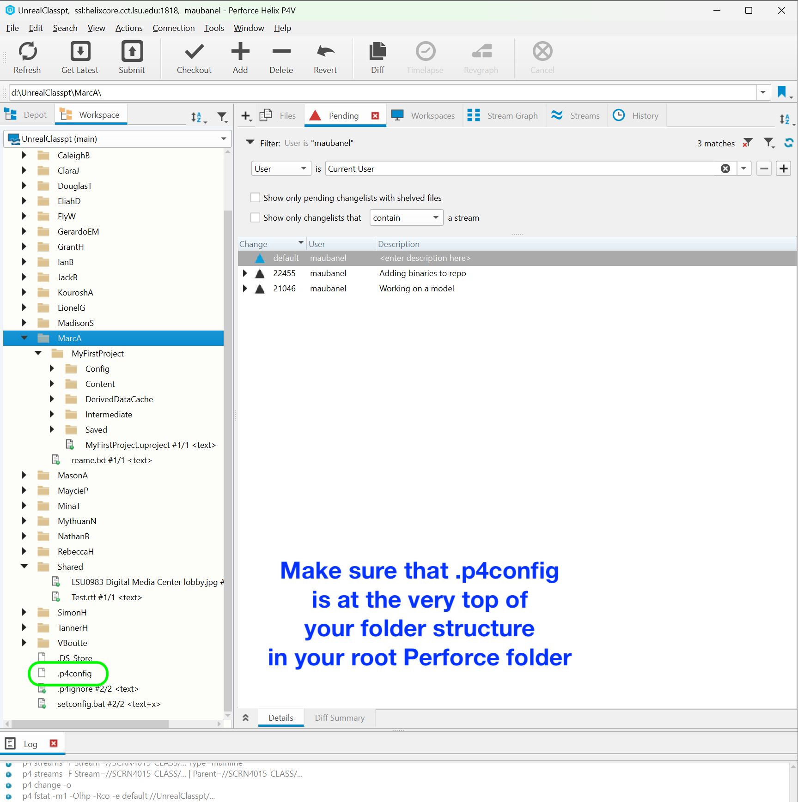

### Setting Up Perforce in UE5

[home](../README.md#user-content-p4v)

If you have a project set up you just need to set-up your [Workspace](https://github.com/maubanel/p4v-unreal/blob/main/workspaces/README.md#user-content-workspaces-in-p4v) and you are ready to go.  This guide is for setting up Unreal for Perforce for the VERY first time use. Only one person on the team needs to do this.  Everyone else will just press <kbd>Get Latest</kbd> to get all the work done here.

 

---

##### `Step 1.`\|`P4VUE5`|:small_blue_diamond:

First make sure you have access to a valid depot for your project.  A depot can contain as many Unreal projects as you like.  Talk to your teacher to get one made for your team.

##### `Step 2.`\|`P4VUE5`|:small_blue_diamond: :small_blue_diamond: 

Pick the appropriate template to start with.  You **HAVE** to put it in the same directory as the name of the depot and the folder within it as to be the same as the depot. So in this case my depot is `//New_Project/`, and the location of the depot is in `C\p4\`.  So I place the project in `C:\p4\New_Project\`.  I then name the project and press the <kbd>Create</kbd> button.

##### `Step 3.`\|`P4VUE5`|:small_blue_diamond: :small_blue_diamond: :small_blue_diamond:

Now we want to turn on one more feature.  We want to go to **Editor Preferences** and turn on **Enable One File Per Actor**.  This only needs to be done once, and even though this will not carry over as the editor preferences are local, the entire project will support this feature.  This allows each actor to be individual files in a level getting rid of level conflicts and allowing multiple people to work on the same level.

##### `Step 4.`\|`P4VUE5`|:small_blue_diamond: :small_blue_diamond: :small_blue_diamond: :small_blue_diamond:

Now if you are using open world levels, then there is nothing else to do. But if you are using regular levels then you need to adjust one setting in **EVERY** level.  If you want to use regular levels, press **File | New Level** and add a **Basic** level.  Name it accordingly.

##### `Step 5.`\|`P4VUE5`| :small_orange_diamond:

Now for each level you will need to go to **World Settings** (it is in **Windows** menu if it does nto appear).  Go to  **World | Advanced | Use External Actors** and set to `true`.

##### `Step 6.`\|`P4VUE5`| :small_orange_diamond: :small_blue_diamond:

Now in the future if you boot up **Unreal** and it is saying it is connected to source control you can put your cursor on top and it will pop up to make sure you have the correct settings.

Open up **Epic Games Launcer** and run **Unreal Engine 5.0.X.**

##### `Step 7.`\|`P4VUE5`| :small_orange_diamond: :small_blue_diamond: :small_blue_diamond:

Press **File | Save All** to save all of your work.  If Unreal insists, you might have to loginto source control.  More information can be found about this in [Setting Up Perforce in UE5](../ue5/README.md#user-content-setting-up-perforce-in-ue5) *for the first time use*.

| [home](../README.md#user-content-p4v) | 
|---|
