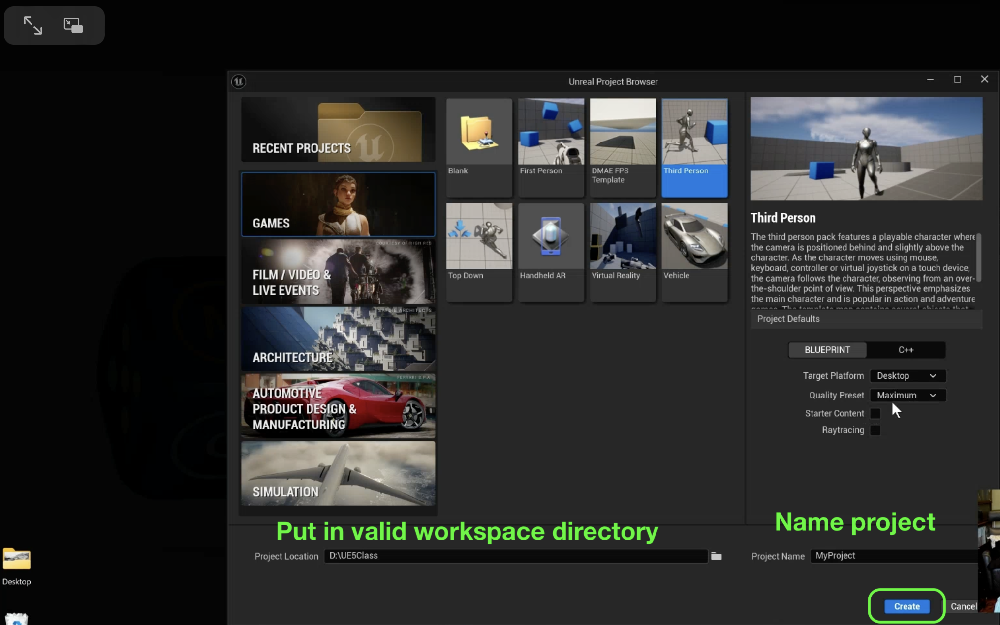
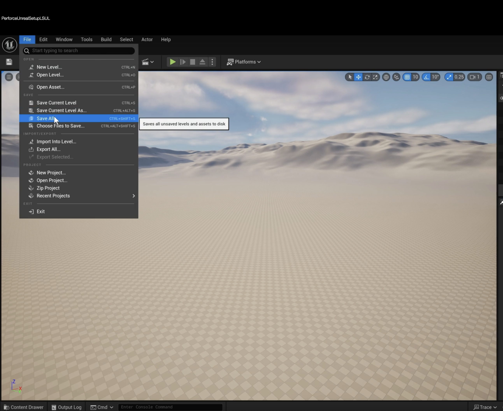

### First Time Setting Up Perforce in UE5

[home](../README.md#user-content-p4v)

If you have a project set up you just need to set-up your [Workspace](https://github.com/maubanel/p4v-unreal/blob/main/workspaces/README.md#user-content-workspaces-in-p4v) and you are ready to go.  This guide is for setting up Unreal for Perforce for the VERY first time use. Only one person on the team needs to do this.  Everyone else will just press <kbd>Get Latest</kbd> to get all the work done here.

https://github.com/user-attachments/assets/677c54a6-06b6-4c0b-8330-3dba2e87d389

[YouTube Link](https://www.youtube.com/watch?v=ljbY4CH_JZE)

 

---

##### `Step 1.`\|`P4VUE5`|🔹

Log into P4V before starting.  We need to be in a valid workspace.  So we start by logging into Perforce. You can select an existing workspace or leave it empty.  Enter your password.

##### `Step 2.`\|`P4VUE5`|🔹🔹

Select the workspace you want to work in and right click on it (to get the Workspace tab Press **View | Workspace**). Select **Switch to Workspace**.

##### `Step 3.`\|`P4VUE5`|🔹🔹🔹

Click on your workspace tab and select the top folder.  Press the **Get Latest** button to get the latest files from the server.  Maybe someone else has checked something new in, or you are bringing in work from another computer.

##### `Step 4.`\|`P4VUE5`|🔹🔹🔹🔹

Make sure you have a valid `p4config` file in the root folder at the very top folder of the workspace.  Make sure your login name and host are valid.

##### `Step 5.`\|`P4VUE5`| 🔸

Open up the **Epic Launcher** and run the latest version of **Unreal**. Make sure that you place the project within your workspace.  If you don't put it in a workspace you will not be able to connect to Perforce.  Give it a name and select the template you want with the appropriate settings.

##### `Step 6.`\|`P4VUE5`| 🔸🔹

In the game on the bottom right corner click on **Revision Control** and select **Connect to Revision Control**. You can now select use `.p4config` but it is not always working properly for me.  It is always good to click on **Available Workspaces** and if nothign pops up you have a type on either the repository or the username.  Remember the username does not use `@email.com`.

##### `Step 7.`\|`P4VUE5`| 🔸🔹🔹

Go to **Edit | Editor Preferences** and select **Loading and Saving | Source Control | Automatically Checkout on Asset Modification**. Set it to `true`. This allows for Unreal to checkout files and stop others from using it as soon as you need them.  We will get into this more in future tip.

##### `Step 8.`\|`P4VUE5`| 🔸🔹🔹🔹

Press **File | Save All** to save all of your work.  If Unreal insists, you might have to loginto source control.  More information can be found about this in [Setting Up Perforce in UE5](../ue5/README.md#user-content-setting-up-perforce-in-ue5) *for the first time use*.

Quit the game.  

##### `Step 9.`\|`P4VUE5`| 🔸🔹🔹🔹🔹

Now you do not need to use the epic launcher to run your game.  It is best to loginto P4V and double click the `.uproject` file from perforce.  This loads the game and should auto connect to Perforce.  It should be a green check mark.  If not connect to revision control as you did above.  Make sure you are connected as you will not be able to save any work.

| [home](../README.md#user-content-p4v) | 
|---|
