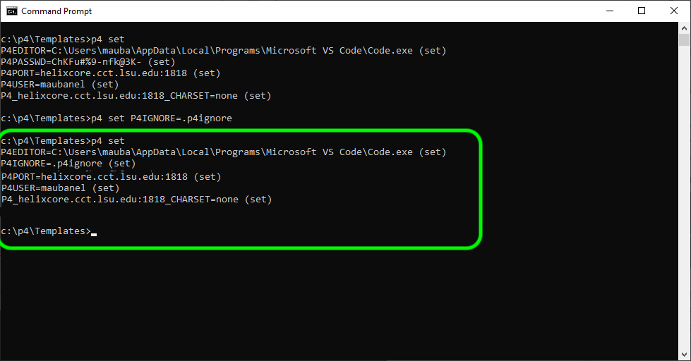

### Workspaces in P4V

[home](../README.md#user-content-p4v)

**Depots** contain the project(s) that you have access to either read, write or both.  They live on the Helix server.  To work you need to have those files locally.  In **Perforce** this is a called a **workspace**.  You can have as many workspaces as you like, but one will suffice. Please note you cannot share workspaces between machines, it is one workspace per computer/login.

 

---

##### `Step 1.`\|`BTS`|:small_blue_diamond:

Now open up and loginto **P4V** and open up the app.  You need to select **View | Workspaces** to select your workspaces tab.

##### `Step 2.`\|`BTS`|:small_blue_diamond: :small_blue_diamond: 

Right mouse click and on the open area in the **Workspaces** tab and select **New Workspace...**.

##### `Step 3.`\|`BTS`|:small_blue_diamond: :small_blue_diamond: :small_blue_diamond:

Now you get a pop up that has all the depots that you have permission to subscribe to. 

##### `Step 4.`\|`BTS`|:small_blue_diamond: :small_blue_diamond: :small_blue_diamond: :small_blue_diamond:

For a classic depot (one without the two waves over the name representing **Streams**), you can decide which depots you want to work on and take up hard drive space.  For Depots you don't want you can right click on them and select `exclude tree`.  There will be a **red X** next to the depot name which means it won't download it and waste space.  Don't worry at any point you can add it to this **Workspace** and download them later.  You would do this by right clicking on a excluded depot and select `include  tree`. A **green checkmark** means that this folder and all of its children will be downloaded to your hard drive.

You cannot combine streamed and classic depot's in the same workspace.  Seperate workspaces need to be set up.

##### `Step 5.`\|`BTS`| :small_orange_diamond:

If you want to connect to a stream depot you can only set up a single workspace to a single streamed project.  Click on the <kbd>Browse</kbd> button and select the stream you want to subscribe to (includes the name and the branch/stream). You can switch streams later on.

##### `Step 6.`\|`BTS`| :small_orange_diamond: :small_blue_diamond:

Now you can pick a **Workspace name:** starting with your P4 user name and the device I am using. I set mine to `maubanel-laptop`.  Try not to use spaces in your names as it will make it easier if you have to use command line.

Select a folder to place it in.  I am putting it in the root of my only drive `c:\p4`. This folder does not have to exist as **P4V** will create it for you. Don't make the name too long.

##### `Step 7.`\|`BTS`| :small_orange_diamond: :small_blue_diamond: :small_blue_diamond:

Select the **Advanced** tab.  Set **Modtime: ...** to `true` so that the timezone of each contributor is respected.  Set **Rmdir:** to `true` so empty folders are removed.  Then select in **On submit:** `Revert unchanged files`.  Set **s** to `true`. Now select <kbd>OK</kbd> to create this new workspace.

##### `Step 8.`\|`BTS`| :small_orange_diamond: :small_blue_diamond: :small_blue_diamond: :small_blue_diamond:

Select the **Workspaces** tab and go to the top of the directory.  Press the <kbd>Get Latest</kbd> button on the top menu. This will create a directory and get all the folders in it.  Be patient, this could take a while if the project is large.

##### `Step 9.`\|`BTS`| :small_orange_diamond: :small_blue_diamond: :small_blue_diamond: :small_blue_diamond: :small_blue_diamond:

Now you will see all the **Depots** that you subscribed to in this **Workspace** in the folder you set it up in.

##### `Step 10.`\|`BTS`| :large_blue_diamond:

Now next time you run **p4v** you can select **Browse** next to **Workspace:** and select the workspace you want.  In this case it is **p4** and then I will press the <kbd>OK</kbd> button.  Then you are loaded into this workspace when it opens.

##### `Step 11.`\|`BTS`| :large_blue_diamond: :small_blue_diamond: 

If you are not in a workspace or in the wrong workspace you can switch to it by select **Connection** and then `Switch to Workspace`. You will then select the workspace you would like to switch to.

##### `Step 12.`\|`BTS`| :large_blue_diamond: :small_blue_diamond: :small_blue_diamond: 

For working in **UE5** you need to make sure the is a `.p4ignore` file in the root of the project (in the same directory as the `.uproject` file). If you are going to be adding an existing project to this folder you can download a preconfigured file [.p4ignore](../files/.p4ignore) and place it in your project folder accordingly.

##### `Step 13.`\|`BTS`| :large_blue_diamond: :small_blue_diamond: :small_blue_diamond:  :small_blue_diamond: 

Now there is a final step. We need to make sure that your workspace is set up to recognize the `.p4ignore` file.  Go to a commmand prompt and enter `p4 set P4IGNORE=.p4ignore` environment variable.

##### `Step 14.`\|`BTS`| :large_blue_diamond: :small_blue_diamond: :small_blue_diamond: :small_blue_diamond:  :small_blue_diamond: 

Now press `p4 set` to see if all your settings are correct.  The most important ones are **P4IGNORE** which should now be set to `.p4ignore`.  The **P4PORT** should be pointing to your Peforce server, in our case `helixcore.cct.lsu.edu:1818` and **P4USER** should be your perforce username.

If any of these are wrong or missing you can set them with `p4 set P4CLIENT=nameofworkspace`.  Make sure there are no spaces before and after the `=` sign.

| [home](../README.md#user-content-p4v) |
|---|
