### Workspaces in P4V

[home](../README.md#user-content-p4v)

Depots are the projects that you have access to either read, write or both.  They live on the LSU servers.  To work you need to have those files locally.  In **Perforce** this is a called a workspace.  You can have as many workspaces as you like, but one will suffice.

 

---

##### `Step 1.`\|`BTS`|:small_blue_diamond:

Now open up and loginto **P4V** and open up the app.  You need to select **View | Workspaces** to select your workspaces tab.

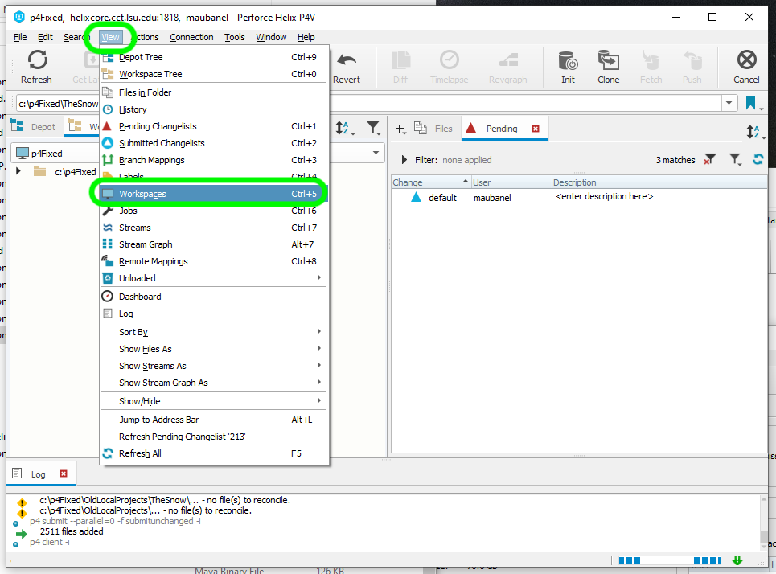

##### `Step 2.`\|`BTS`|:small_blue_diamond: :small_blue_diamond: 

Right mouse click and on the open area in the **Workspaces** tab and select **New Workspace...**.

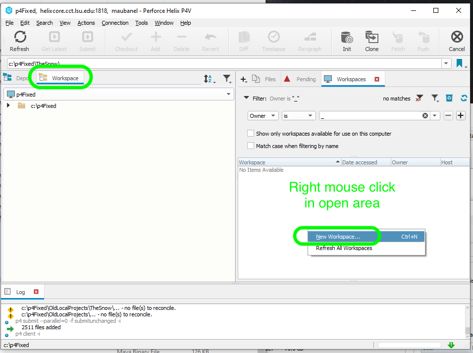

##### `Step 3.`\|`BTS`|:small_blue_diamond: :small_blue_diamond: :small_blue_diamond:

Now you get a pop up that has you selected to add all the depots that you have permission to. We will now unsubscribe to some of the depots that we don't need.

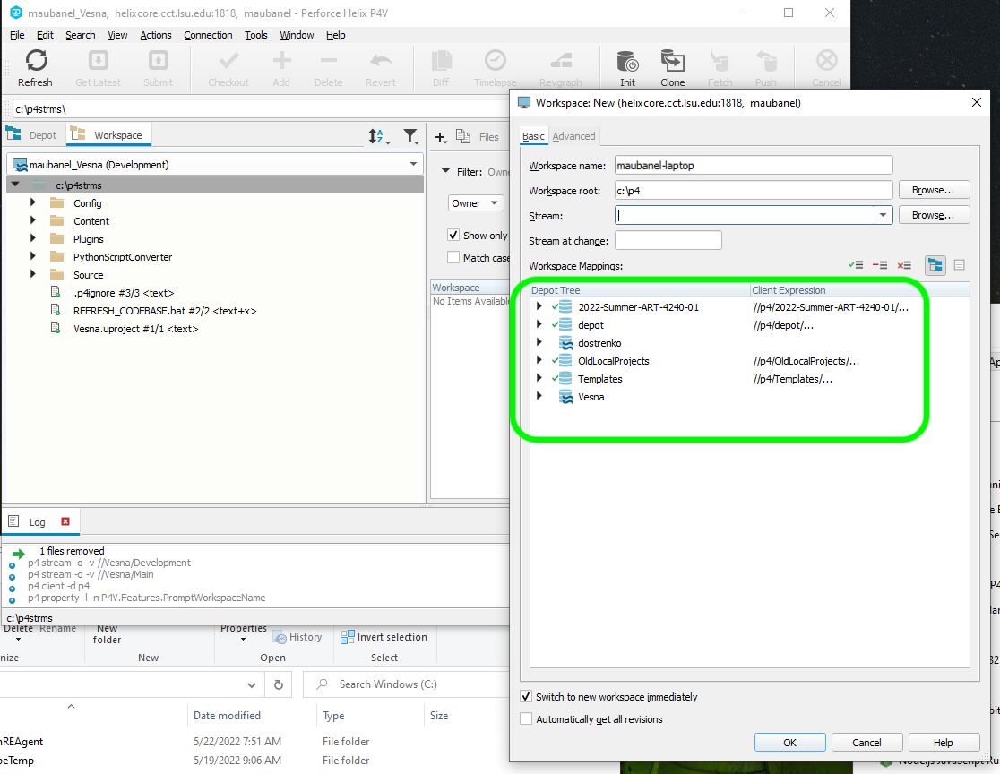

##### `Step 4.`\|`BTS`|:small_blue_diamond: :small_blue_diamond: :small_blue_diamond: :small_blue_diamond:

We don't need the **Templates** or the **OldLocalProjects** so you can right click on them and select `exclude tree`.  There will be a **red X** next to the depot name which means it won't download it and waste space.  Don't worry at any point you can add it to this depot and download them at any time.

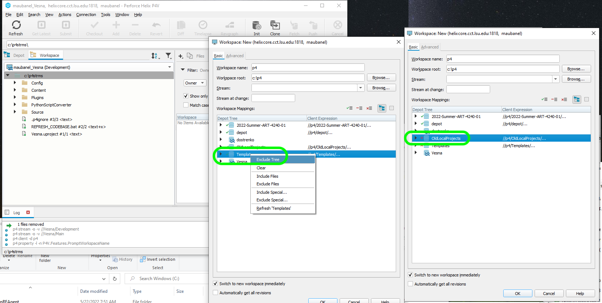

##### `Step 5.`\|`BTS`| :small_orange_diamond:

Now you can pick a **Workspace name:** starting with your P4 user name. I set mine to `maubanel-p4`.  Try not to use spaces in your names as it will make it easier if you have to use command line.

Select a folder to place it in.  I am putting it in the root of my only drive `c:\p4`.

Now select which depots you would like to sync with.

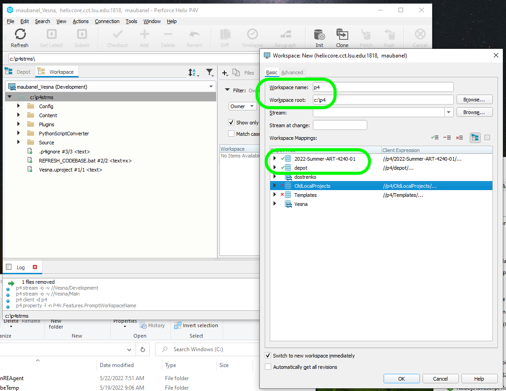

##### `Step 6.`\|`BTS`| :small_orange_diamond: :small_blue_diamond:

Select the **Advanced** tab.  Set **Modtime: ...** to `true` so that the timezone of each contributor is respected.  Set **Rmdir:** to `true` so empty folders are removed.  Then select in **On submit:** `Revert unchanged files`.  Now select <kbd>OK</kbd> to create this new workspace.

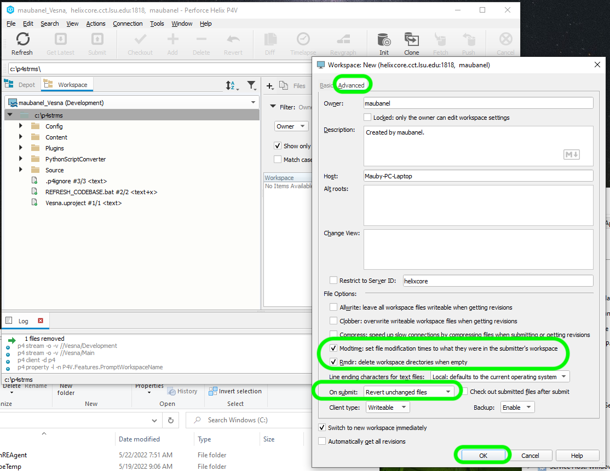

##### `Step 7.`\|`BTS`| :small_orange_diamond: :small_blue_diamond: :small_blue_diamond:

Select the **Workspaces** tab and go to the top of the directory.  Press the <kbd>Get Latest</kbd> button on the top menu.

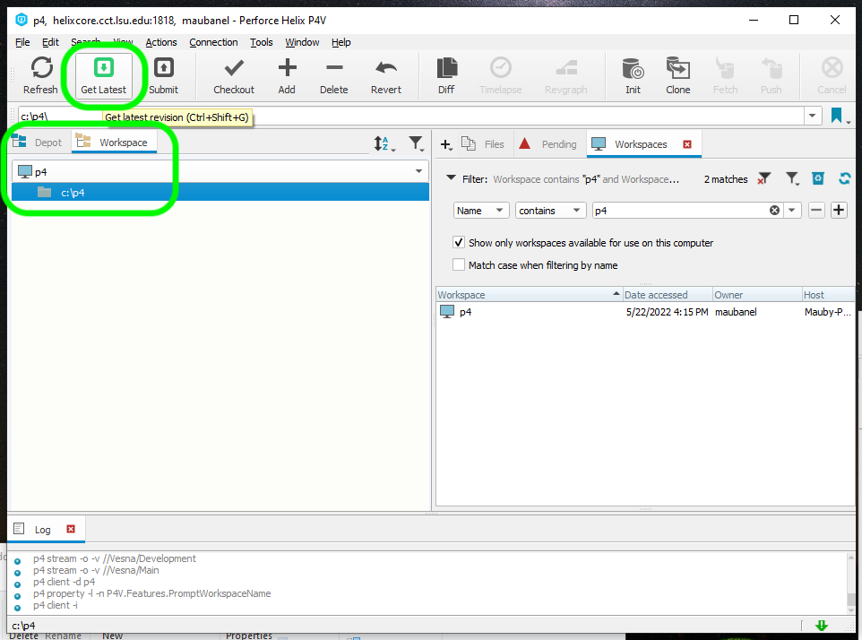

##### `Step 8.`\|`BTS`| :small_orange_diamond: :small_blue_diamond: :small_blue_diamond: :small_blue_diamond:

Now this will download all the files in the depot.  Go to your depot in **Finder** and you will see the files in the workspace.  Now in this project we have a single file called `.p4ignore`.

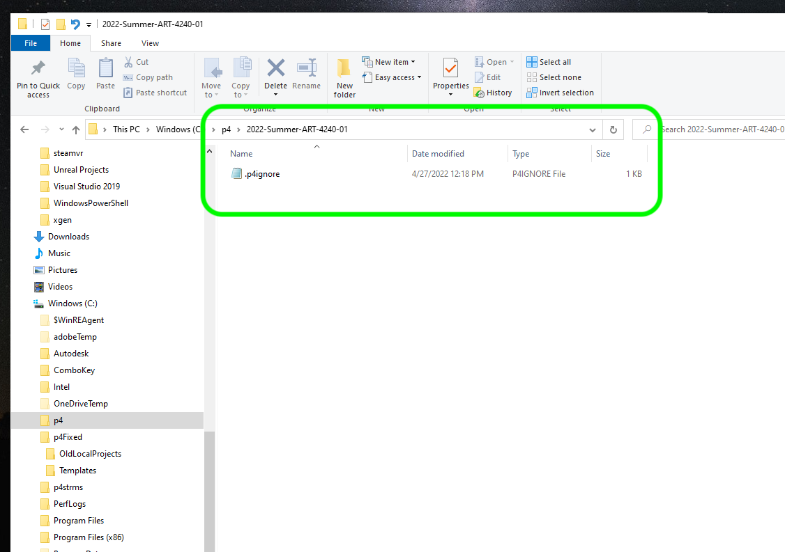

##### `Step 9.`\|`BTS`| :small_orange_diamond: :small_blue_diamond: :small_blue_diamond: :small_blue_diamond: :small_blue_diamond:

Now next time you run **p4v** you can select **Browse** next to **Workspace:** and select the workspace you want.  In this case it is **p4** and then I will press the <kbd>OK</kbd> button.  Then you are loaded into this workspace when it opens.

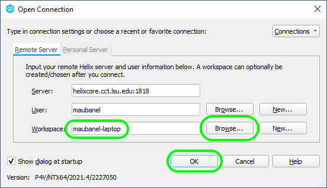

##### `Step 10.`\|`BTS`| :large_blue_diamond:

Now we need to make sure that your workspace is set up to recognize the `.p4ignore` file.  Go to a commmand prompt and enter `p4 set P4IGNORE=.p4ignore` environment variable.

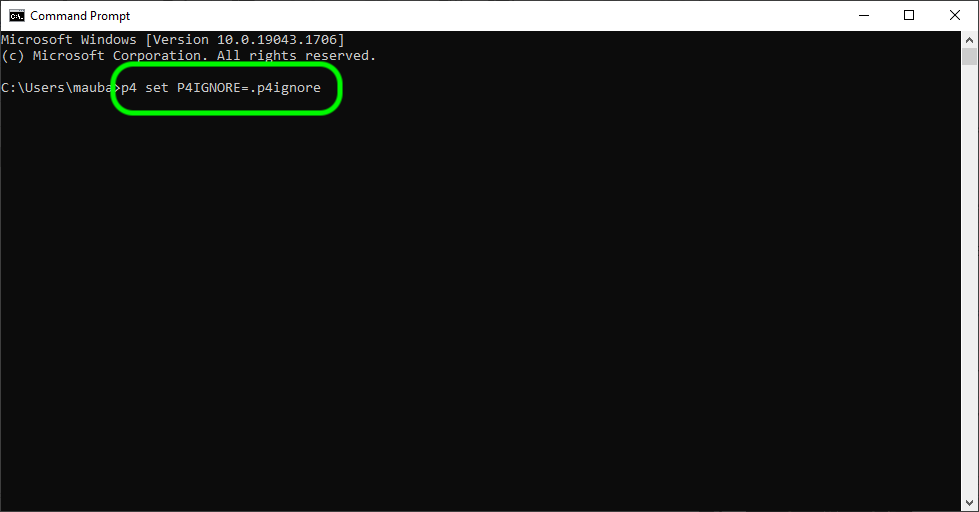

##### `Step 11.`\|`BTS`| :large_blue_diamond: :small_blue_diamond: 

Confirm that the `.p4ignore` file works by right clicking on the depot then selecting `Reconcile Offline Work...`.  Files in the `.p4ignore` file should not be included.  In this case our file in the **Saved** folder was not added to the depot.

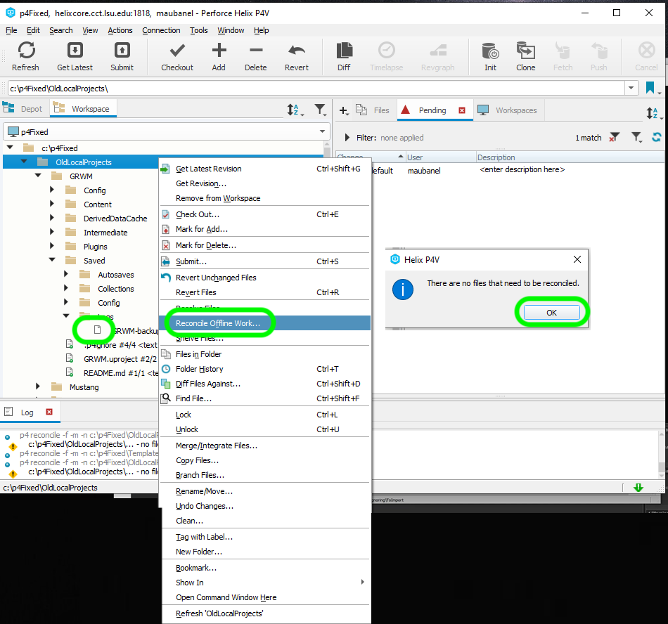

| [home](../README.md#user-content-p4v) |
|---|
