### Workspaces in P4V

[home](../README.md#user-content-p4v)

**Depots** contain the project(s) that you have access to either read, write or both.  They live on the Helix server.  To work you need to have those files locally.  In **Perforce** this is a called a **workspace**.  You can have as many workspaces as you like, but one will suffice. Please note you cannot share workspaces between machines, it is one workspace per computer/login.

Follow this entire walk through if you do not have a workspace on your computer.  Please note that you can have as many projects in a single workspace as you like.  If you are using regular perforce workspaces **AND** streams you will needa separate workspace for regular spaces and one for streams.

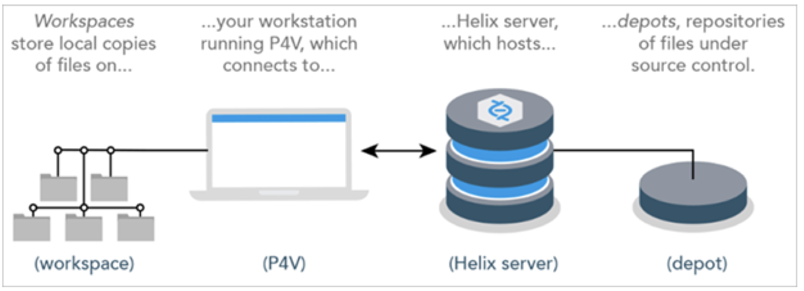

 

---

##### `Step 1.`\|`BTS`|:small_blue_diamond:

Now open up and loginto **P4V** and open up the app.  You need to select **View | Workspaces** to select your workspaces tab.

##### `Step 2.`\|`BTS`|:small_blue_diamond: :small_blue_diamond: 

Right mouse click and on the open area in the **Workspaces** tab and select **New Workspace...**.

##### `Step 3.`\|`BTS`|:small_blue_diamond: :small_blue_diamond: :small_blue_diamond:

Now you get a pop up that has all the depots that you have permission to subscribe to. 

##### `Step 4.`\|`BTS`|:small_blue_diamond: :small_blue_diamond: :small_blue_diamond: :small_blue_diamond:
There are two types of depots classic and streams.  Most larger project with larger teams should try and use **Streams**. If you are creating a workspace for a **Streams** depot press on the <kbd>Browse</kbd> button next to **Streams** and select the stream.  You can only have one stream per stream workspace. The streams workspace has two waves over the name. **Do not** make a classic depot with a streams project!

For a classic depot (one **without** the two waves over the name), you can have multiple depots on the same workspace. You can decide which depots you want to work on and take up hard drive space.  For Depots you don't want you can right click on them and select `exclude tree`.  There will be a **red X** next to the depot name which means it won't download it and waste space.  Don't worry at any point you can add it to this **Workspace** and download them later.  You would do this by right clicking on a excluded depot and select `include  tree`. A **green checkmark** means that this folder and all of its children will be downloaded to your hard drive.

You cannot combine streamed and classic depot's in the same workspace.  Seperate workspaces need to be set up. Also, when you exclude a tree, it will free up hard drive space but will NOT delete the depot in **Perforce**.  It will allow you to only have downloaded the projects you need to work on.

##### `Step 5.`\|`BTS`| :small_orange_diamond:

If you want to connect to a stream depot you can only set up a single workspace to a single streamed project.  Click on the <kbd>Browse</kbd> button and select the stream you want to subscribe to (includes the name and the branch/stream). You can switch streams later on.

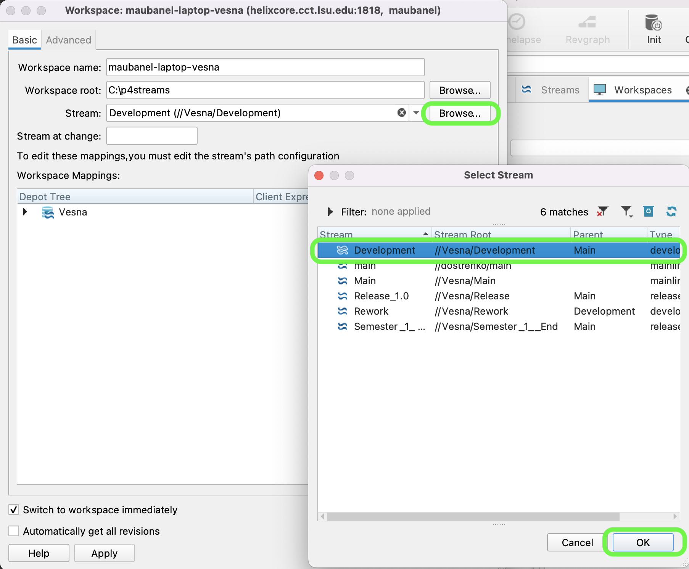

##### `Step 6.`\|`BTS`| :small_orange_diamond: :small_blue_diamond:

Now you can pick a **Workspace name:** starting with your P4 user name and the device I am using. I set mine to `maubanel-laptop`.  Try not to use spaces in your names as it will make it easier if you have to use command line.

Perforce and Unreal have file length limits (which includes the folders) so it is recommended to use short names and close to a root drive like **C:** or **D:**.

Select a folder to place it in.  I am putting it in the root of my only drive `c:\p4`. This folder does not have to exist as **P4V** will create it for you. Don't make the name too long.

##### `Step 7.`\|`BTS`| :small_orange_diamond: :small_blue_diamond: :small_blue_diamond:

Select the **Advanced** tab.  Set **Modtime: ...** to `true` so that the timezone of each contributor is respected.  Set **Rmdir:** to `true` so empty folders are removed.  Then select in **On submit:** `Revert unchanged files`.  Set **Automatically get all revisions** to `true`. Now select <kbd>OK</kbd> to create this new workspace.

##### `Step 8.`\|`BTS`| :small_orange_diamond: :small_blue_diamond: :small_blue_diamond: :small_blue_diamond:

Select the **Workspaces** tab and go to the top of the directory.  Press the <kbd>Get Latest</kbd> button on the top menu. This will create a directory and get all the folders in it.  Be patient, this could take a while if the project is large.

##### `Step 9.`\|`BTS`| :small_orange_diamond: :small_blue_diamond: :small_blue_diamond: :small_blue_diamond: :small_blue_diamond:

Now you will see all the **Depots** that you subscribed to in this **Workspace** in the folder you set it up in.

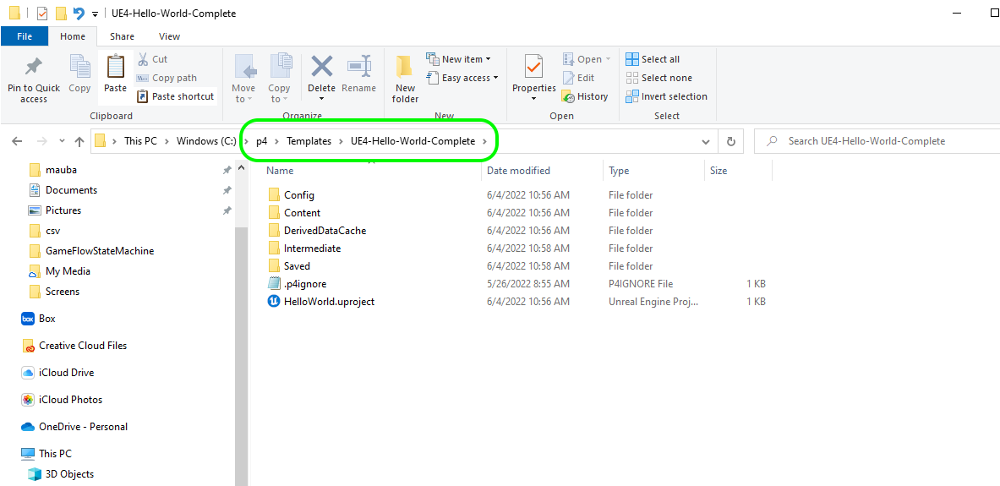

##### `Step 10.`\|`BTS`| :large_blue_diamond:

Now next time you run **p4v** you can select **Browse** next to **Workspace:** and select the workspace you want.  In this case it is **p4** and then I will press the <kbd>OK</kbd> button.  Then you are loaded into this workspace when it opens.

##### `Step 11.`\|`BTS`| :large_blue_diamond: :small_blue_diamond: 

If you are not in a workspace or in the wrong workspace you can switch to it by select **Connection** and then `Switch to Workspace`. You will then select the workspace you would like to switch to.

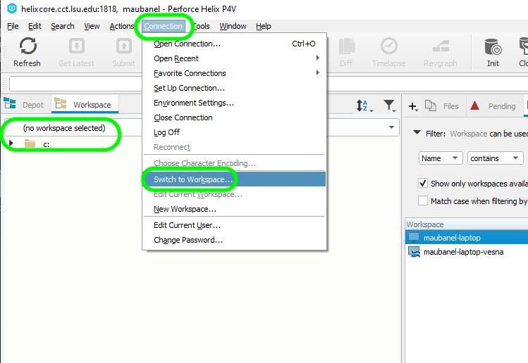

##### `Step 12.`\|`BTS`| :large_blue_diamond: :small_blue_diamond: :small_blue_diamond: 

You need to make sure the is a `.p4ignore` file in the root of the project. If you are going to be adding an existing project to this folder you can download a preconfigured file [.p4ignore](../files/.p4ignore) by right clicking on **Raw** and selecting **Save Link** and call it `.p4ignore` (very important to have the dot before the `p4ignore` as it is a hidden file).  Make sure you chnage the **Save as type** to `All Files(*.*)`. Place it in the root of your project folder accordingly. Make sure there is no `.txt` extension at the end. 

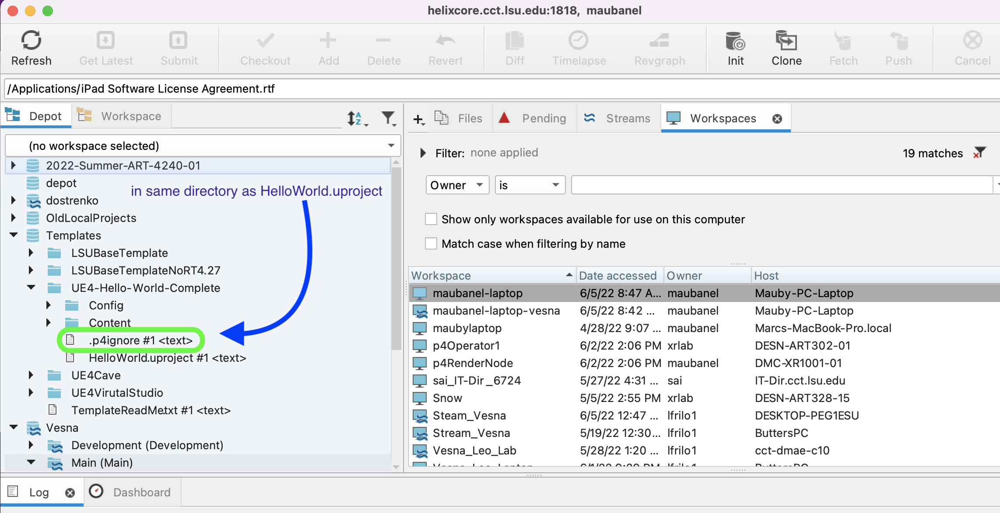

##### `Step 13.`\|`BTS`| :large_blue_diamond: :small_blue_diamond: :small_blue_diamond:  :small_blue_diamond: 

Now there is a final step. We need to make sure that your workspace is set up every time you run **P4V**.  Download [setconfig.bat](../files/setconfig.bat) by right clicking on **Raw** and selecting **Save As** and call it `setconfig.bat`. Put it in the same directory as the **.p4ignore** file. Press the **Refresh** button in **P4V** and you should see the folder.

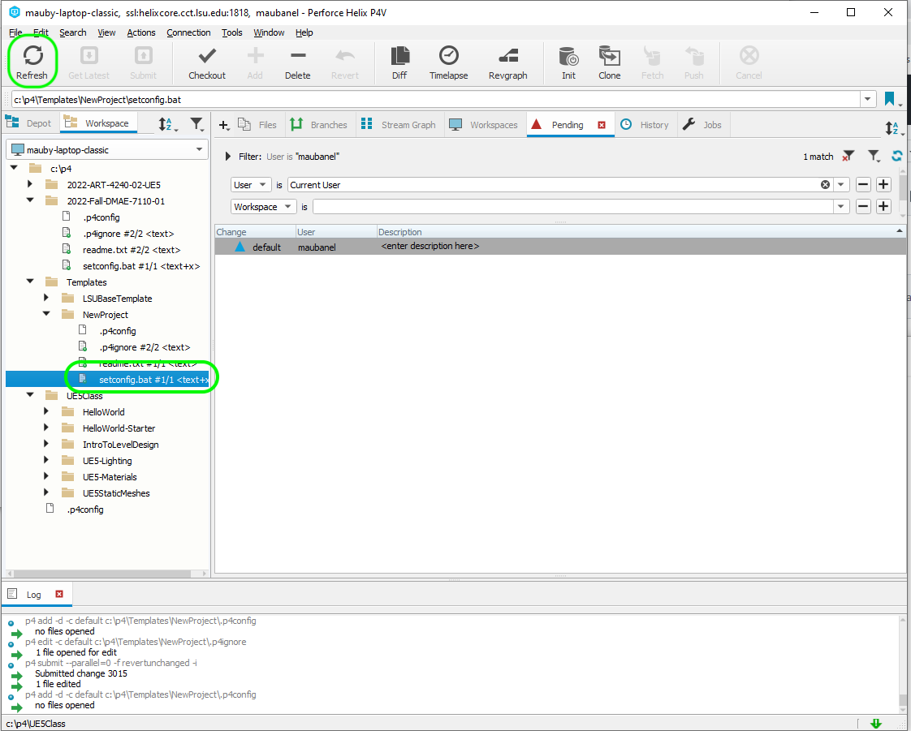

##### `Step 14.`\|`BTS`| :large_blue_diamond: :small_blue_diamond: :small_blue_diamond: :small_blue_diamond:  :small_blue_diamond: 

Select in **P4V** with the right mouse button the **setconfig.bat** file and select **Show In | Show in Explorer**. If **Windows Protect** comes up and the select **More info** and the <kbd>Run Anyway</kbd>. 

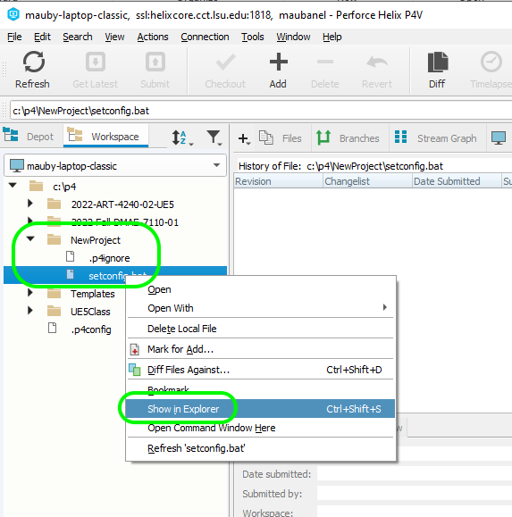

##### `Step 15.`\|`SUU&G`| :large_blue_diamond: :small_orange_diamond: 

Double click in **Explorer** the **setconfig.bat** batch file. If windows complains about the file press **More info** then press the <kbd>Open Anyway</kbd> button. Enter the **username** used to login to **P4V**.  This should be your lsu user name without the @lsu.edu.  The back in **P4V** get to your **Workspace** tab (Press **View | Workspace** to get it on your menu bar) and double click on your workspace.  Copy the **Host:** then in command prompt press the right mouse button to paste it into the command line. Press the <kbd>Enter</kbd> key.  Repeat for the actual **Workspace** name. Press <kbd>Enter</kbd> again and you will get the output of `p4 set`.  We should have the **P4Client**, **P4CONFIG**, **P4Host**, **P4IGNORE**, **P4PORT** and **P4USER** set.  

Please note that as long as you do not change the order of files this config file will always run ensuring that you are set up correctly in **P4V** moving forward.

https://user-images.githubusercontent.com/5504953/191112088-026fb56a-588e-4a55-a529-876095b25bb1.mp4

##### `Step 16.`\|`SUU&G`| :large_blue_diamond: :small_orange_diamond:   :small_blue_diamond: 

Now we need to add these files we created to **Perforce**.  Press the <kbd>+ Add</kbd> button and select a **New** changelist.  Add an appropriate message and press the <kbd>OK</kbd> button.

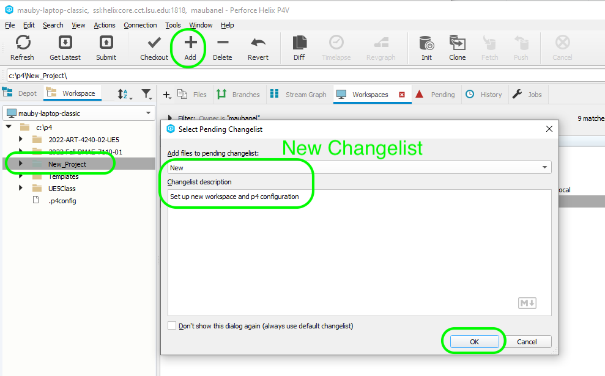

##### `Step 17.`\|`SUU&G`| :large_blue_diamond: :small_orange_diamond: :small_blue_diamond: :small_blue_diamond:

Put the cursor on the project folder in **P4V** and select the <kbd>Submit</kbd> button. This will bring up the changelist you created and press the popped up kbd>Submit</kbd> button. 

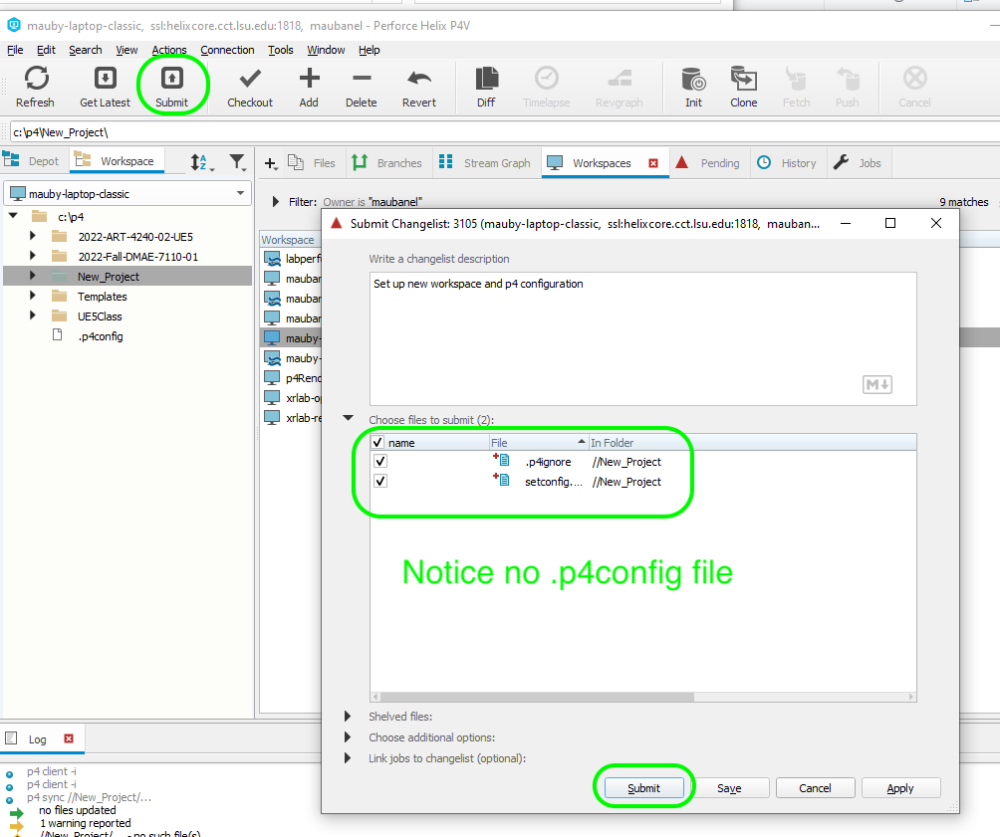

##### `Step 18.`\|`SUU&G`| :large_blue_diamond: :small_orange_diamond: :small_blue_diamond: :small_blue_diamond: :small_blue_diamond:

Notice that the .p4ignore and setconfig.bat are checked into the project as they have a small green check mark.  Notice that the **.p4config** file does not have a green checkmark.  That is becuase the `.p4ignore` file is stopping that file from being uploaded to the depot and being shared with other users.

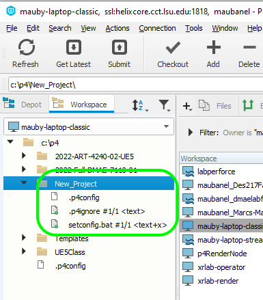

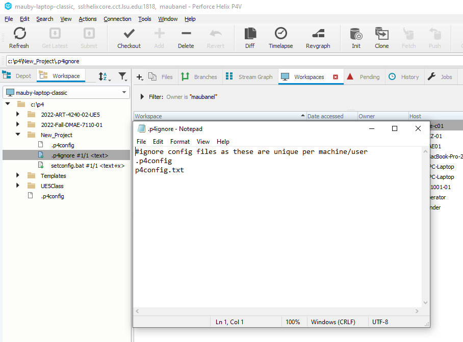

##### `Step 19.`\|`SUU&G`| :large_blue_diamond: :small_orange_diamond: :small_blue_diamond: :small_blue_diamond: :small_blue_diamond: :small_blue_diamond:

Now if you select the **Depot** tab you can see what is up on the server (and will be seen by other users when they press **Get Latest**).  Notice that it has the two files with the checkmark but not the `.p4config` file which is left off because of the ignore file.

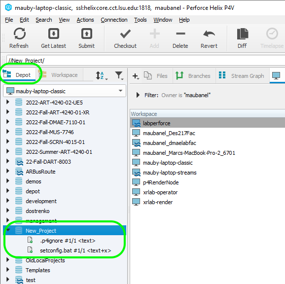

| [home](../README.md#user-content-p4v) |
|---|
