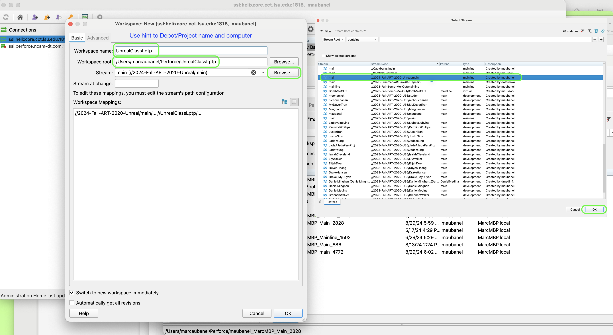

### Workspaces in P4V

[home](../README.md#user-content-p4v)

**Depots** contain the project(s) that you have access to either read, write or both.  They live on the Helix server.  To work you need to have those files locally.  In **Perforce** this is a called a **workspace**.  You can have as many workspaces as you like, but one will suffice. Please note you cannot share workspaces between machines, it is one workspace per computer/login.

Follow this entire walk through if you do not have a workspace on your computer.  In this walk through we will only be covering Perforce Stream Projects.

Watch the below in video form on [YouTube](https://www.youtube.com/watch?v=LJ7jrB9tCTM).

 

---

##### `Step 1.`\|`BTS`|:small_blue_diamond:

Now open up and loginto **P4V** and open up the app.  You need to select **View | Workspaces** to select your workspaces tab.

##### `Step 2.`\|`BTS`|:small_blue_diamond: :small_blue_diamond: 

Right mouse click and on the open area in the **Workspaces** tab and select **New Workspace...**.

##### `Step 3.`\|`BTS`|:small_blue_diamond: :small_blue_diamond: :small_blue_diamond:

Now you get a pop up that has all the depots that you have permission to subscribe to. 

##### `Step 4.`\|`BTS`|:small_blue_diamond: :small_blue_diamond: :small_blue_diamond: :small_blue_diamond:

Give the depot a **Workspace Name**. The default name is not very helpful, I would call it something short and descriptive that describes the project and the computer I am using.  For example I could use `UnrealClassLptp`. You cannot use the same name as the depot it will not allow a workspace to share the exact name with a **Depot**.

Select a location **Workspace Root** with enough room for your project. I use the actual name of the **Depot** so I don't get confused. If you have a second drive on your desktop/laptop it might be best to save the data here.  Use only SSD (preferably VVMe drives) for fast access.  NEVER STORE A REPO ON A CLOUD SERVICE like Icloud, Box, OneDrive or any other cloud drive service. 

Try to keep it as close to the root drive as possible as Perforce does have a character limit to how long your folder chain can be. In this case I only have a single drive and it is a Mac so I am keeping it in the default Perforce folder root to my user (same as PC that will keep it at: `c:User/Username/Perforce`.

Select a 

*Press* the **Browse** button on the **Stream** and select the **Depot**/Project you want to use.

##### `Step 5.`\|`BTS`| :small_orange_diamond:

Select the **Advanced** tab.  Set **Modtime: ...** to `true` so that the timezone of each contributor is respected.  Set **Rmdir:** to `true` so empty folders are removed.  Then select in **On submit:** `Revert unchanged files`.  Set **Automatically get all revisions** to `true`. Now select <kbd>OK</kbd> to create this new workspace.

##### `Step 6.`\|`BTS`| :small_orange_diamond: :small_blue_diamond:

Select the **Workspaces** tab and go to the top of the directory.  Press the <kbd>Get Latest</kbd> button on the top menu. This will create a directory and get all the folders in it.  Be patient, this could take a while if the project is large.

##### `Step 7.`\|`BTS`| :small_orange_diamond: :small_blue_diamond: :small_blue_diamond:

Now you will see all the **Depots** that you subscribed to in this **Workspace** in the folder you set it up in.

##### `Step 8.`\|`BTS`| :small_orange_diamond: :small_blue_diamond: :small_blue_diamond: :small_blue_diamond:

Now next time you run **p4v** you can select **Browse** next to **Workspace:** and select the workspace you want.  In this case it is **p4** and then I will press the <kbd>OK</kbd> button.  Then you are loaded into this workspace when it opens.

##### `Step 9.`\|`BTS`| :small_orange_diamond: :small_blue_diamond: :small_blue_diamond: :small_blue_diamond: :small_blue_diamond:

If you are not in a workspace or in the wrong workspace you can switch to it by select **Connection** and then `Switch to Workspace`. You will then select the workspace you would like to switch to.

| [home](../README.md#user-content-p4v) |
|---|
